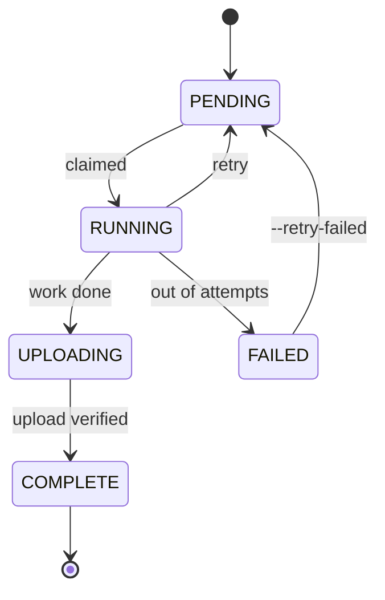

<div align="center">

# ContentFactory

**Makes short vertical videos from nothing.** It picks a story idea, writes it, narrates it, draws every scene, scores it, and cuts the whole thing into a 1080×1920 MP4 that's ready to post.


Three of its videos. Nobody wrote, drew, voiced, scored or edited any part of them.

[](https://github.com/DamnKuldeep/ContentFactory/actions/workflows/ci.yml)
[](LICENSE)


</div>

---

## What it does

Five stages. Each one runs a different model and hands its output to the next.


| Stage | Does | Runs on |
|---|---|---|
| **Story** | Picks an idea, writes the story, the spoken script, and a prompt for each scene | Llama&nbsp;3.3, Qwen3-VL, Gemma&nbsp;4 (via OpenRouter) |
| **Narration** | Reads the script out loud, and works out when each word is said | Fish Speech S2 Pro + WhisperX |
| **Images** | One illustration per scene, 28–40 of them | FLUX.2-klein |
| **Music** | An original score built around the narration's energy | Qwen2.5-Omni + ACE-Step 1.5 |
| **Video** | Cuts it together: subtitles, motion, transitions, audio mix | FFmpeg |

A stage grabs a job, does its one thing, uploads the result to Google Drive, and updates a row in a shared SQLite database. That's the entire coordination model. No queue server, no scheduler process, no always-on box. Laptops can join or drop out whenever.

I ran it as a **100-video batch across three laptops** — one writing stories on CPU, one doing all three GPU stages, one cutting video. 88 finished. The other 12 died because the API key hit its spending limit, which is in the [run notes](docs/RESULTS.md) along with everything else that broke.

---

## Samples

Click a thumbnail to play it. Each is about 90 seconds, 1080×1920, 28–40 scenes.

<table>
<tr>
<td align="center" width="20%"><a href="docs/media/samples/sample_1.mp4"></a></td>
<td align="center" width="20%"><a href="docs/media/samples/sample_2.mp4"></a></td>
<td align="center" width="20%"><a href="docs/media/samples/sample_3.mp4"></a></td>
<td align="center" width="20%"><a href="docs/media/samples/sample_4.mp4"></a></td>
<td align="center" width="20%"><a href="docs/media/samples/sample_5.mp4"></a></td>
</tr>
<tr>
<td align="center"><sub><a href="docs/media/samples/sample_1.mp4">1 · 1:40</a></sub></td>
<td align="center"><sub><a href="docs/media/samples/sample_2.mp4">2 · 1:35</a></sub></td>
<td align="center"><sub><a href="docs/media/samples/sample_3.mp4">3 · 1:32</a></sub></td>
<td align="center"><sub><a href="docs/media/samples/sample_4.mp4">4 · 1:33</a></sub></td>
<td align="center"><sub><a href="docs/media/samples/sample_5.mp4">5 · 1:37</a></sub></td>
</tr>
</table>

<sub>Shrunk to 540×960 so cloning doesn't take forever. Timing, subtitles and audio are exactly as rendered.</sub>

A few things in them that took real work:

- **The white word is always the one being spoken.** Not a per-line timer — every character of the script has its own timestamp.
- **Images change on the beat**, because scene cuts are computed from those same timestamps instead of a fixed duration.
- **34 images that look like one artist drew them.** Style, palette and character descriptions get locked in stage 1 and injected into every prompt.
- **The music follows the voice.** It's written against an energy curve pulled out of the finished narration, so it thins out under quiet delivery and swells at the turn.
- **The mix is stable across every video.** Music sits at a fixed fraction of the narration's *measured* loudness, then ducks under it.

---

## The parts that were actually hard

Calling an image model is easy. These were the problems:

### Subtitles that stay in sync with a TTS that mumbles

Fish generates the audio, then WhisperX transcribes what it *actually said* — and those two don't match. It swallows a syllable, splits "Chacabuco" into three words, drops a filler. Zip the heard words onto the script words and the whole video drifts.

So [`fish.py`](stages/stage_02_narration/fish.py) diffs the two word lists with `difflib`, copies timings straight across wherever they match, interpolates across the bits where they don't, fills the gaps between known anchors, forces the result to move forward in time, then spreads word timings down to individual characters. Comes out the same shape ElevenLabs charges you for.

### Three model stacks, one 24 GB GPU

Fish, FLUX.2 and ACE-Step have dependency pins that flat-out conflict, so each stage gets its own virtualenv built by its own setup script — all sharing one weights cache so you don't download 40 GB twice.

They also don't fit in VRAM together. Stage 3 reads the card's memory and picks its batch size from that. Stage 4 explicitly kicks Qwen out of VRAM before ACE-Step loads, because those two won't co-exist on 24 GB. `BGM_TWO_PASS=0` exists for the same reason.

### Surviving bad wifi

Running this for real broke it in ways a demo never would:

- The image worker kept dying with `rc=139` and no traceback. Turned out concurrent uploads were racing inside OpenSSL. Serialised the upload pool — it still overlaps with the next batch of images, so nothing got slower.
- Stage 5 wrote a bunch of 0-byte images and then segfaulted. Google's Drive client isn't thread-safe; sharing one across a download pool corrupts things. Downloads are serial now.
- Two workers rendered the same story once, which is double GPU time for one video. The claim was a SELECT then an UPDATE with nothing in between. Now it's `UPDATE ... WHERE status='PENDING'` and whoever gets `rowcount == 1` wins.

Every upload gets size-checked against the local file and retried if it doesn't match. Stage 3 lists what's already in Drive before it starts, so an interrupted 34-image render picks up where it stopped.

### An LLM setup that argues with itself

Stage 1 isn't a prompt, it's about 1,500 lines. Generators and critics come from different model families on purpose — a model grading its own work is too easy on itself. Llama writes prose and grades Qwen's scene plans; Gemma grades Qwen's image prompts; Qwen-VL is kept off text critique entirely because its verdicts were unusable.

The segmentation trick is my favourite bit. The model doesn't rewrite the script into beats — it returns *cut positions*, and the code slices the original script at those points. So the narration can't be paraphrased even if the model wants to, and a deterministic splitter cleans up the count afterwards.

### No browsers on headless boxes

A GPU box can't complete an OAuth consent screen, and a worker that opens a browser mid-batch just hangs there forever. So [`drive.py`](shared/drive.py) only ever refreshes a token that's already on disk — the browser flow physically isn't in that code path. You authorise once on a laptop with `scripts/drive_auth.py` and copy two files to every machine.

---

## How the machines talk to each other

Local disk is scratch. Everything real lives in Drive, including the job database, so a machine dying mid-batch costs you nothing.

```
                    Google Drive
        ┌──────────────────────────────────┐
        │  manifest.sqlite   (job database) │
        │  Batch_<id>/video_<n>/            │
        │      metadata  narration  images  │
        │      music     subtitles  final   │
        └──────────────────────────────────┘
             ▲  pull once           │  push after
             │  at startup          ▼  each stage
        ┌──────────────────────────────────┐
        │  worker machine                   │
        │  local manifest.sqlite  ← workers │
        │  (full speed, no network per job) │
        └──────────────────────────────────┘
```

The point is that workers never touch the network to check for work. They hit a local SQLite file. The orchestrator pulls the shared database once when it starts and pushes back only the rows for stages *this machine owns*, under a short Drive lock. Since each machine owns different stages, merges can't conflict.

Jobs move like this:



A stage-3 job only becomes claimable once that same story's stage-2 job says `COMPLETE`. That's one `EXISTS` sub-query, and it's the entire scheduler. It's why `python scripts/worker.py images` needs no batch ID and no coordinator — it just drains whatever is ready.

More detail in [ARCHITECTURE.md](docs/ARCHITECTURE.md).

---

## Speed and cost

I wrapped a timer around every meaningful operation (`shared/timing.py`), which writes one JSON line per step when `PROFILE_LOG` is set. Nothing below is a guess.

One video, 34 scenes, 88 seconds of narration, on an RTX 5090 laptop:

| Stage | Wall clock | GPU time |
|---|---:|---:|
| Story (API only) | 13.6 min | — |
| Narration | 3.1 min | 170 s |
| Images | 4.4 min | 121 s |
| Music | 1.4 min | 81 s |
| Video | 2.0 min | — |
| **Total** | **~25 min** | **~375 s** |

**375 GPU-seconds per video** is the number that matters, since that's what you'd actually pay for. Model loading alone was 84 s of it.

Then I A/B'd it properly — two arms, three videos each, everything else identical:

| What I tried | Result |
|---|---|
| `torch.compile` on Fish TTS | 138 s → 60 s. **Twice as fast.** Worth it. |
| `torch.compile` on FLUX | 13.5 s → 11.0 s per batch. ~18% faster. Worth it. |
| `torch.compile` on FLUX, `reduce-overhead` mode | CUDA graphs eat 2.7 GB and OOM after ~20 images. Don't. |
| Prompt caching on the LLM calls | Nothing. The control arm was *already* 17% cached — OpenRouter's providers do it themselves whether you ask or not. |

**About 90 GPU-seconds saved per video, ~24%**, and nearly all of it is the Fish compile.

The catch is that `torch.compile` pays a one-time build cost when a process starts, so it only wins if that process then does a lot of videos. Which is exactly why the bulk path (`scripts/worker.py <role>`) loads its model once and drains everything ready, rather than spawning per job.

Method and raw numbers: [PERFORMANCE.md](docs/PERFORMANCE.md) · [AB_FINDINGS.md](bench/AB_FINDINGS.md) · [latency_report.md](docs/latency_report.md)

---

## Review and posting

I didn't want it posting on its own. One bad video on a real account is worse than ten good ones being late.

```
  finished video  →  Google Sheet  →  review app  →  approved queue  →  posts
                                       (approve /                       1 per platform
                                        reject)                         per 4 hours
```

The Sheet is the database. That sounds lazy but it's the right call: reviewers need no account, no login, no backend, and anyone can look at the state or fix a row by hand. The uploader reads its throttle out of the Sheet rather than keeping it in memory, so you can kill it, restart it, run it only when your laptop's open, and it still paces itself correctly and never double-posts.

Details in [PUBLISHING.md](docs/PUBLISHING.md).

---

## Layout

```
run.py                  the CLI
shared/                 the parts every stage uses
  manifest.py             job database — claiming, readiness, retries
  drive_db.py             syncing that database through Drive
  drive.py                Drive client, refresh-only auth, verified uploads
  llm.py                  OpenRouter with retries, JSON repair, a cost meter
  subtitles.py            the rolling karaoke subtitle builder
  audio.py                loudness measurement and the BGM level
  narration_features.py   the energy curve the music is built on
  video_fx.py             Ken Burns maths, transition picking
  timing.py               the profiler behind every number above
stages/                 one folder per stage
scripts/                setup, workers, auth, profiling, reset
social/                 review sheet, captions, Instagram + YouTube
review_app/             the Gradio review queue
tests/                  32 tests, no GPU needed
bench/                  the A/B harness and what it found
research/               the experiment scripts this all grew out of
docs/                   architecture, runbook, performance, results
```

Tests cover the two things that can't be wrong: the job scheduler's guarantees, and the alignment→subtitle maths. No GPU, no network, no credentials, under a second.

```bash
python -m unittest discover -s tests -v
```

---

## Running it

You'll need Python 3.10+, an NVIDIA GPU (24 GB is comfortable) for stages 2–4, ffmpeg for stage 5, an OpenRouter key, and a Google OAuth desktop client.

```bash
git clone https://github.com/DamnKuldeep/ContentFactory.git && cd ContentFactory
cp .env.example .env          # fill in your key and Drive folder id
python scripts/drive_auth.py  # once, on a machine with a browser
```

Copy `credentials.json` and `token.json` to every other machine. They'll never ask again.

Then set up whichever stages that machine runs. Separate venvs, because the dependencies really do conflict:

```bash
python scripts/setup_story.py      # ../.venv_story
python scripts/setup_narration.py  # ../.venv_narration   Fish + WhisperX
python scripts/setup_images.py     # ../.venv_images      FLUX.2
python scripts/setup_bgm.py        # ../.venv_bgm         Qwen + ACE-Step
python scripts/setup_compose.py    # ../.venv_compose     needs ffmpeg
```

**Normal use** — seed once, then run a worker per role:

```bash
# story box
python scripts/produce.py --count 150

# GPU box, one role at a time
source ../.venv_narration/bin/activate && python scripts/worker.py narration
source ../.venv_images/bin/activate    && python scripts/worker.py images
source ../.venv_bgm/bin/activate       && python scripts/worker.py music

# compose box
source ../.venv_compose/bin/activate   && python scripts/worker.py compose

python run.py --list-videos    # what came out
```

**When you want control over one stage** — batch IDs, worker counts, a live progress view:

```bash
python run.py --stage 1 --count 5 --drive-db        # prints a batch id
python run.py --stages 2 3 4 --batch <id> --drive-db
python run.py --stage 5 --batch <id> --drive-db
python run.py --resume --stages 4 5 --batch <id>    # continue on a different machine
```

Everything's resumable. Re-run a worker and it takes only what's left, interrupted jobs get released after a timeout, and `--retry-failed` puts the dead ones back in the queue.

Full runbook with every flag and the troubleshooting table: [RUNME.md](docs/RUNME.md).

---

## Docs

| | |
|---|---|
| [ARCHITECTURE.md](docs/ARCHITECTURE.md) | How it's built — stages, modules, data flow, the multi-machine bits |
| [RUNME.md](docs/RUNME.md) | Setup, every run mode, resuming, troubleshooting |
| [PERFORMANCE.md](docs/PERFORMANCE.md) | Where the time goes and what actually made it faster |
| [RESULTS.md](docs/RESULTS.md) | The 100-video run and everything that broke during it |
| [PUBLISHING.md](docs/PUBLISHING.md) | Review queue and posting |
| [deployment/](docs/deployment/) | What hardware each stage wants |

---

## Things worth knowing

- The voice mangles the odd proper noun. That's the TTS, not the sync — subtitles still land on the right word.
- FLUX writes gibberish when a prompt asks for readable text in the image. You can see it on a couple of close-ups.
- Two machines running the *same* stage at once isn't supported. One machine per stage is the tested setup, and the Drive lock is best-effort because Drive has no atomic compare-and-swap.
- Stage 1 costs about $0.10 a video in API calls. Stages 2–5 are free once you own the GPU.
- The Instagram uploader uses `instagrapi`, which is unofficial and against their ToS. It's throttled to human pace and should point at a burner account. YouTube uses the official API.
- Stories are fictional on purpose. The prompt bans defaming real living people and won't build a story on identity-based violence.

## License

MIT — see [LICENSE](LICENSE).
