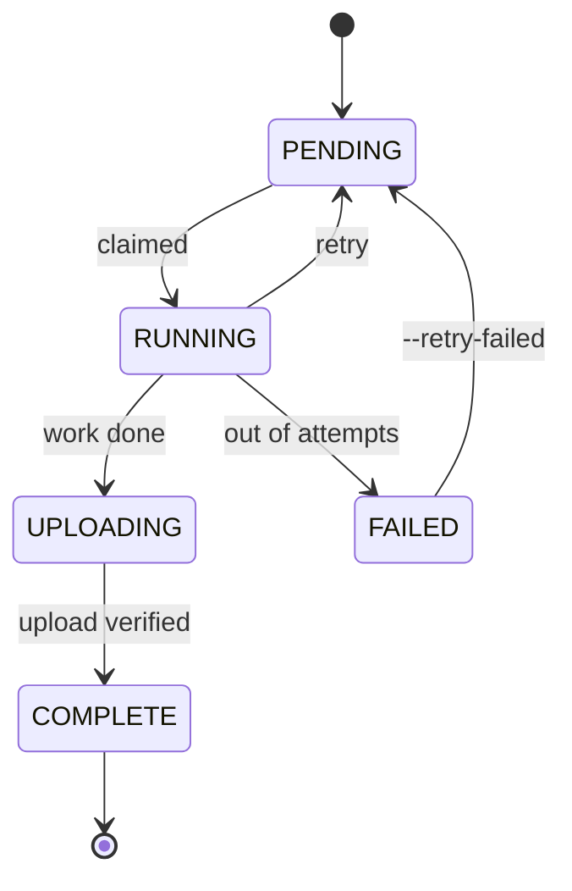

<div align="center">

# ContentFactory

**Makes short vertical videos from nothing.** Picks a story idea, writes it, narrates it, draws every scene, scores it, and cuts the whole thing into a 1080×1920 MP4 that's ready to post.


<sub>Three of its videos. Nobody wrote, drew, voiced, scored or edited any part of them.</sub>

[](https://github.com/DamnKuldeep/ContentFactory/actions/workflows/ci.yml)
[](LICENSE)


**88 videos made in one batch** · 5 model stacks on 3 machines · **~375 GPU-seconds a video**, then 24% off that

[Samples](#what-it-makes) · [How it works](#how-it-works) · [Run it](#running-it) · [The hard parts](#the-interesting-problems) · [Speed](#speed-and-cost) · [Docs](#docs)

</div>

---

## What it makes

Click any of these to play it. Each is about 90 seconds, 1080×1920, 28–40 scenes.

<table>
<tr>
<td align="center" width="20%"><a href="docs/media/samples/sample_1.mp4"></a></td>
<td align="center" width="20%"><a href="docs/media/samples/sample_2.mp4"></a></td>
<td align="center" width="20%"><a href="docs/media/samples/sample_3.mp4"></a></td>
<td align="center" width="20%"><a href="docs/media/samples/sample_4.mp4"></a></td>
<td align="center" width="20%"><a href="docs/media/samples/sample_5.mp4"></a></td>
</tr>
<tr>
<td align="center"><sub><a href="docs/media/samples/sample_1.mp4">1:40</a></sub></td>
<td align="center"><sub><a href="docs/media/samples/sample_2.mp4">1:35</a></sub></td>
<td align="center"><sub><a href="docs/media/samples/sample_3.mp4">1:32</a></sub></td>
<td align="center"><sub><a href="docs/media/samples/sample_4.mp4">1:33</a></sub></td>
<td align="center"><sub><a href="docs/media/samples/sample_5.mp4">1:37</a></sub></td>
</tr>
</table>

<sub>Shrunk to 540×960 so cloning stays quick. Timing, subtitles and audio are untouched.</sub>

Worth watching for, because none of it comes free:

- **The white word is always the one being spoken.** Not a per-line timer — every character of the script carries its own timestamp.
- **Images change on the beat**, because scene cuts come from those same timestamps rather than a fixed duration.
- **34 images that look like one artist drew them.** Style, palette and character descriptions are locked in stage 1 and pushed into every prompt.
- **The music follows the voice**, because it's written against an energy curve pulled out of the finished narration.
- **Voice and music sit right in every video.** The music level is a fraction of the narration's *measured* loudness, then ducked underneath it.

---

## How it works

Five stages. Each runs a different model and hands off to the next.


| Stage | Does | Runs on |
|---|---|---|
| **Story** | Picks an idea, writes the story, the spoken script, and a prompt for every scene | Llama&nbsp;3.3, Qwen3-VL, Gemma&nbsp;4 (OpenRouter) |
| **Narration** | Reads the script aloud and works out when each word lands | Fish Speech S2 Pro + WhisperX |
| **Images** | One illustration per scene, 28–40 of them | FLUX.2-klein |
| **Music** | An original score built around the narration's energy | Qwen2.5-Omni + ACE-Step 1.5 |
| **Video** | Cuts it together — subtitles, motion, transitions, audio mix | FFmpeg |

A stage grabs a job, does its one thing, uploads the result to Google Drive, and updates a row in a shared SQLite database. That's the whole coordination model. No queue server, no scheduler process, nothing that has to stay up. Machines join and drop out whenever.

The 88-video batch ran on three laptops: one writing stories on CPU, one doing all three GPU stages back to back, one cutting video.

---

## Running it

You'll need Python 3.10+, an NVIDIA GPU (24 GB is comfortable) for stages 2–4, ffmpeg for stage 5, an OpenRouter key, and a Google OAuth desktop client.

```bash
git clone https://github.com/DamnKuldeep/ContentFactory.git && cd ContentFactory
cp .env.example .env          # your API key and Drive folder id
python scripts/drive_auth.py  # once, on a machine with a browser
```

Copy `credentials.json` and `token.json` to every other machine — they'll never ask again.

Then set up whichever stages that machine runs. Separate venvs, because the dependencies really do conflict:

```bash
python scripts/setup_story.py      # ../.venv_story
python scripts/setup_narration.py  # ../.venv_narration   Fish + WhisperX
python scripts/setup_images.py     # ../.venv_images      FLUX.2
python scripts/setup_bgm.py        # ../.venv_bgm         Qwen + ACE-Step
python scripts/setup_compose.py    # ../.venv_compose     needs ffmpeg
```

**Normal use** — seed once, then run a worker per role:

```bash
# story box
python scripts/produce.py --count 150

# GPU box, one role at a time
source ../.venv_narration/bin/activate && python scripts/worker.py narration
source ../.venv_images/bin/activate    && python scripts/worker.py images
source ../.venv_bgm/bin/activate       && python scripts/worker.py music

# compose box
source ../.venv_compose/bin/activate   && python scripts/worker.py compose

python run.py --list-videos    # what came out
```

**When you want control over one stage** — batch ids, worker counts, a live progress view:

```bash
python run.py --stage 1 --count 5 --drive-db        # prints a batch id
python run.py --stages 2 3 4 --batch <id> --drive-db
python run.py --stage 5 --batch <id> --drive-db
python run.py --resume --stages 4 5 --batch <id>    # continue on a different machine
```

Everything's resumable. Re-run a worker and it takes only what's left, interrupted jobs get released after a timeout, and `--retry-failed` puts anything that gave up back in the queue.

Every flag and a troubleshooting table: **[RUNME.md](docs/RUNME.md)**.

---

## The interesting problems

Calling an image model is easy. These were the parts worth solving.

### Subtitles that stay in sync with a TTS that mumbles

Fish generates the audio, then WhisperX transcribes what it *actually said* — and those two don't match. It swallows a syllable, splits "Chacabuco" into three words, drops a filler. Zip the heard words onto the script words and the whole video drifts out of sync.

So [`fish.py`](stages/stage_02_narration/fish.py) diffs the two word lists, copies timings straight across where they match, interpolates across the bits where they don't, fills gaps between known anchors, forces the result to move forward in time, then spreads word timings down to individual characters. What comes out is the same shape ElevenLabs charges you for.

That per-character timeline is what everything downstream leans on. Subtitle words, scene cuts, the music's target length — all of it resolves through the same object.

### Three model stacks, one 24 GB GPU

Fish, FLUX.2 and ACE-Step pin conflicting versions of the same packages, so each stage gets its own virtualenv built by its own setup script — all sharing one weights cache so nothing downloads 40 GB twice.

They don't fit in VRAM together either. Stage 3 reads the card's memory and picks its batch size from that. Stage 4 explicitly evicts Qwen before ACE-Step loads, because those two won't co-exist on 24 GB.

### Making it survive a real network

A few things only show up once you're running hundreds of jobs over home wifi:

- Concurrent Drive uploads race inside OpenSSL and take the process down with no traceback. The upload pool is one thread now — it still overlaps with the next batch of images, so nothing got slower.
- Google's Drive client isn't thread-safe. Sharing one across a download pool writes 0-byte files. Downloads are serial.
- Job claiming has to be atomic or two workers eventually take the same job. It's `UPDATE ... WHERE status='PENDING'`, and whoever gets `rowcount == 1` wins.

Uploads are size-checked against the local file and retried on mismatch. Stage 3 lists what's already in Drive before starting, so an interrupted 34-image render carries on instead of starting over.

### An LLM setup that argues with itself

Stage 1 isn't a prompt, it's about 1,500 lines. Generators and critics come from different model families on purpose — a model grading its own work is far too generous. Llama writes prose and grades Qwen's scene plans, Gemma grades Qwen's image prompts, and Qwen-VL stays off text critique entirely because its verdicts were unusable.

My favourite bit is the segmentation. The model doesn't rewrite the script into beats — it returns *cut positions*, and the code slices the original script at those points. So the narration can't be paraphrased even if the model tries, and a deterministic splitter tidies up the count afterwards.

### No browsers on headless boxes

A GPU box can't complete an OAuth consent screen, and a worker that opens a browser mid-batch just hangs there. So [`drive.py`](shared/drive.py) only ever refreshes a token that's already on disk — the browser flow isn't in that code path at all. You authorise once on a laptop and copy two files around.

---

## How machines share work

Local disk is scratch. Everything real lives in Drive, including the job database, so losing a machine mid-batch costs nothing.

```
                    Google Drive
        ┌──────────────────────────────────┐
        │  manifest.sqlite   (job database) │
        │  Batch_<id>/video_<n>/            │
        │      metadata  narration  images  │
        │      music     subtitles  final   │
        └──────────────────────────────────┘
             ▲  pull once           │  push after
             │  at startup          ▼  each stage
        ┌──────────────────────────────────┐
        │  worker machine                   │
        │  local manifest.sqlite  ← workers │
        │  (full speed, no network per job) │
        └──────────────────────────────────┘
```

The point is that workers never touch the network to look for work. They hit a local SQLite file. The orchestrator pulls the shared database once at startup and pushes back only the rows for stages *this machine owns*, under a short Drive lock. Different machines own different stages, so merges can't conflict.

Jobs move like this:



A stage-3 job only becomes claimable once that same story's stage-2 job says `COMPLETE`. That's one `EXISTS` sub-query, and it is the entire scheduler — which is why `python scripts/worker.py images` needs no batch id and no coordinator. It just drains whatever's ready.

Full write-up: **[ARCHITECTURE.md](docs/ARCHITECTURE.md)**.

---

## Speed and cost

I wanted a real number for what a video costs, so `shared/timing.py` wraps a timer around every meaningful operation and writes a JSON line per step when `PROFILE_LOG` is set. Nothing below is a guess.

One video, 34 scenes, 88 seconds of narration, RTX 5090 laptop:

| Stage | Wall clock | GPU time |
|---|---:|---:|
| Story (API only) | 13.6 min | — |
| Narration | 3.1 min | 170 s |
| Images | 4.4 min | 121 s |
| Music | 1.4 min | 81 s |
| Video | 2.0 min | — |
| **Total** | **~25 min** | **~375 s** |

**375 GPU-seconds per video** is the number that matters, since it's what you'd actually pay for. 84 seconds of it was just loading models.

Then I A/B'd it — two arms, three videos each, everything else identical:

| What I tried | Result |
|---|---|
| `torch.compile` on Fish TTS | 138 s → 60 s. **Twice as fast.** |
| `torch.compile` on FLUX | 13.5 s → 11.0 s per batch. 18% faster. |
| `torch.compile` on FLUX, `reduce-overhead` | CUDA graphs eat 2.7 GB and OOM after ~20 images. Don't. |
| Prompt caching on the LLM calls | Nothing. The control arm was *already* 17% cached — OpenRouter's providers do it themselves whether you ask or not. |

**About 90 GPU-seconds saved per video, roughly 24%**, and nearly all of it is the Fish compile.

The prompt-cache result is the one I'd point at. It looked like an obvious win and measuring it showed the benefit was already there. That's the argument for instrumenting before optimising.

The catch with compile is that it pays a one-time build cost when a process starts, so it only wins if that process then does a lot of videos — which is exactly why the bulk worker loads its model once and drains everything ready instead of spawning per job.

Method and raw numbers: **[PERFORMANCE.md](docs/PERFORMANCE.md)** · [AB_FINDINGS.md](bench/AB_FINDINGS.md) · [latency_report.md](docs/latency_report.md)

---

## Review and posting

I didn't want it posting on its own. One bad video on a real account is worse than ten good ones being late.

```
  finished video  →  Google Sheet  →  review app  →  approved queue  →  posts
                                       approve /                       1 per platform
                                        reject                          per 4 hours
```

The Sheet is the database. That sounds lazy but it's the right call — reviewers need no account and no backend, and anyone can read or fix the state by hand. The uploader reads its throttle out of the Sheet rather than holding it in memory, so you can kill it, restart it, run it only when your laptop's open, and it still paces itself and never double-posts.

Details: **[PUBLISHING.md](docs/PUBLISHING.md)**.

---

## Layout

```
run.py                  the CLI
shared/                 the parts every stage uses
  manifest.py             job database — claiming, readiness, retries
  drive_db.py             syncing that database through Drive
  drive.py                Drive client, refresh-only auth, verified uploads
  llm.py                  OpenRouter with retries, JSON repair, a cost meter
  subtitles.py            the rolling karaoke subtitle builder
  audio.py                loudness measurement and the BGM level
  narration_features.py   the energy curve the music is built on
  video_fx.py             Ken Burns maths, transition picking
  timing.py               the profiler behind every number above
stages/                 one folder per stage
scripts/                setup, workers, auth, profiling, reset
social/                 review sheet, captions, Instagram + YouTube
review_app/             the Gradio review queue
tests/                  32 tests, no GPU needed
bench/                  the A/B harness and what it found
research/               the experiment scripts this grew out of
docs/                   architecture, runbook, performance, results
```

Tests cover the two things that can't be wrong — the scheduler's guarantees and the alignment-to-subtitle maths. No GPU, no network, no credentials, under a second:

```bash
python -m unittest discover -s tests -v
```

---

## Docs

| | |
|---|---|
| [ARCHITECTURE.md](docs/ARCHITECTURE.md) | How it's built — stages, modules, data flow, the multi-machine bits |
| [RUNME.md](docs/RUNME.md) | Setup, every run mode, resuming, troubleshooting |
| [PERFORMANCE.md](docs/PERFORMANCE.md) | Where the time goes and what actually made it faster |
| [RESULTS.md](docs/RESULTS.md) | The samples and the batch run |
| [PUBLISHING.md](docs/PUBLISHING.md) | Review queue and posting |
| [deployment/](docs/deployment/) | What hardware each stage wants |

---

## Known limits

- The voice mangles the odd proper noun. That's the TTS, not the sync — subtitles still land on the right word.
- FLUX writes gibberish when a prompt asks for readable text inside the image.
- Two machines can't run the *same* stage at once. One machine per stage is the tested setup.
- Stage 1 costs around $0.10 a video in API calls. Stages 2–5 are free once you own the GPU.
- The Instagram uploader uses `instagrapi`, which is unofficial and against their ToS. It's throttled to human pace and should point at a burner account. YouTube uses the official API.
- Stories are fictional on purpose — the prompt won't defame real living people or build a story on identity-based violence.

## What I'd do next

Stage 1 is the wall-clock bottleneck at ~14 minutes a video, and it's pure API work, so it's the obvious thing to parallelise hard. Beyond that: a proper lease-based lock so two machines could safely share a stage, and per-thread Drive clients to get parallel downloads back in stage 5.

## License

MIT — see [LICENSE](LICENSE).
