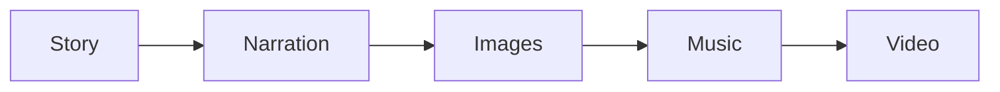
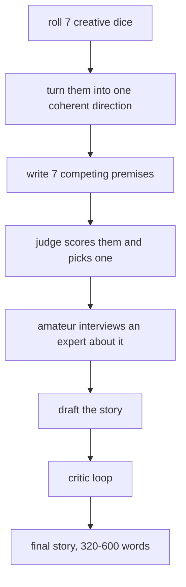
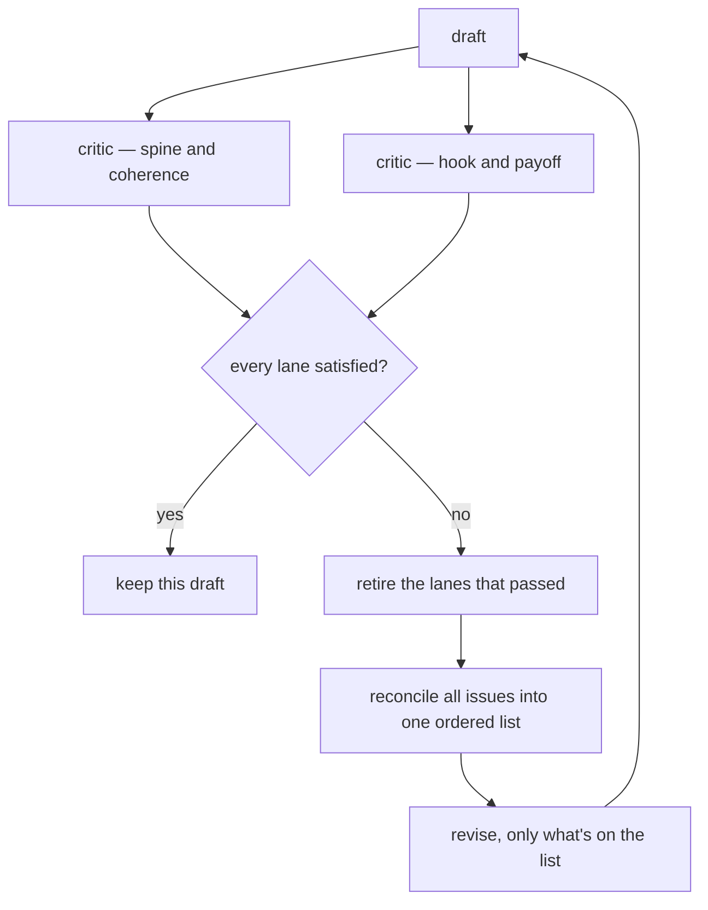
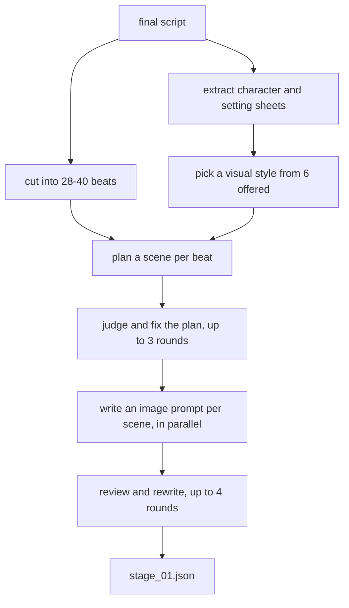
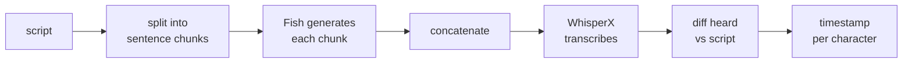
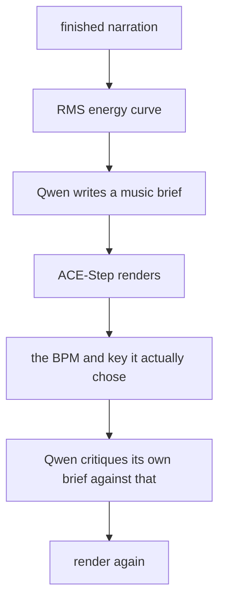
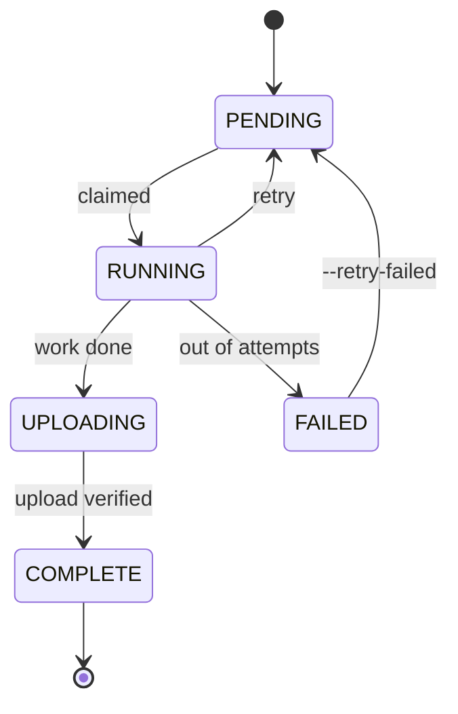

<div align="center">

# ContentFactory

**Makes short vertical videos from nothing.** Picks a story idea, writes it, narrates it, draws every scene, scores it, and cuts the whole thing into a 1080×1920 MP4 that's ready to post.


<sub>Three of its videos. Nobody wrote, drew, voiced, scored or edited any part of them.</sub>

[](https://github.com/DamnKuldeep/ContentFactory/actions/workflows/ci.yml)
[](LICENSE)


**88 videos made in one batch** · 5 model stacks on 3 machines · **~375 GPU-seconds a video**, then 24% off that

[Samples](#what-it-makes) · [How it works](#how-it-works) · [Run it](#running-it) · [Inside each stage](#inside-each-stage) · [Speed](#speed-and-cost) · [Docs](#docs)

</div>

---

## What it makes

Click any of these to play it. Each is about 90 seconds, 1080×1920, 28–40 scenes.

<table>
<tr>
<td align="center" width="20%"><a href="docs/media/samples/sample_1.mp4"></a></td>
<td align="center" width="20%"><a href="docs/media/samples/sample_2.mp4"></a></td>
<td align="center" width="20%"><a href="docs/media/samples/sample_3.mp4"></a></td>
<td align="center" width="20%"><a href="docs/media/samples/sample_4.mp4"></a></td>
<td align="center" width="20%"><a href="docs/media/samples/sample_5.mp4"></a></td>
</tr>
<tr>
<td align="center"><sub><a href="docs/media/samples/sample_1.mp4">1:40</a></sub></td>
<td align="center"><sub><a href="docs/media/samples/sample_2.mp4">1:35</a></sub></td>
<td align="center"><sub><a href="docs/media/samples/sample_3.mp4">1:32</a></sub></td>
<td align="center"><sub><a href="docs/media/samples/sample_4.mp4">1:33</a></sub></td>
<td align="center"><sub><a href="docs/media/samples/sample_5.mp4">1:37</a></sub></td>
</tr>
</table>

<sub>Shrunk to 540×960 so cloning stays quick. Timing, subtitles and audio are untouched.</sub>

Worth watching for, because none of it comes free:

- **The white word is always the one being spoken.** Not a per-line timer — every character of the script carries its own timestamp.
- **Images change on the beat**, because scene cuts come from those same timestamps rather than a fixed duration.
- **34 images that look like one artist drew them.** Style, palette and character descriptions are locked in stage 1 and pushed into every prompt.
- **The music follows the voice**, because it's written against an energy curve pulled out of the finished narration.
- **Voice and music sit right in every video.** The music level is a fraction of the narration's *measured* loudness, then ducked underneath it.

---

## How it works

Five stages. Each runs a different model and hands off to the next.



| Stage | Does | Runs on |
|---|---|---|
| **Story** | Picks an idea, writes the story, the spoken script, and a prompt for every scene | Llama&nbsp;3.3, Qwen3-VL, Gemma&nbsp;4 (OpenRouter) |
| **Narration** | Reads the script aloud and works out when each word lands | Fish Speech S2 Pro + WhisperX |
| **Images** | One illustration per scene, 28–40 of them | FLUX.2-klein |
| **Music** | An original score built around the narration's energy | Qwen2.5-Omni + ACE-Step 1.5 |
| **Video** | Cuts it together — subtitles, motion, transitions, audio mix | FFmpeg |

A stage grabs a job, does its one thing, uploads the result to Google Drive, and updates a row in a shared SQLite database. That's the whole coordination model. No queue server, no scheduler process, nothing that has to stay up. Machines join and drop out whenever.

The 88-video batch ran on three laptops: one writing stories on CPU, one doing all three GPU stages back to back, one cutting video.

---

## Running it

You'll need Python 3.10+, an NVIDIA GPU (24 GB is comfortable) for stages 2–4, ffmpeg for stage 5, an OpenRouter key, and a Google OAuth desktop client.

```bash
git clone https://github.com/DamnKuldeep/ContentFactory.git && cd ContentFactory
cp .env.example .env          # your API key and Drive folder id
python scripts/drive_auth.py  # once, on a machine with a browser
```

Copy `credentials.json` and `token.json` to every other machine — they'll never ask again.

Then set up whichever stages that machine runs. Separate venvs, because the dependencies really do conflict:

```bash
python scripts/setup_story.py      # ../.venv_story
python scripts/setup_narration.py  # ../.venv_narration   Fish + WhisperX
python scripts/setup_images.py     # ../.venv_images      FLUX.2
python scripts/setup_bgm.py        # ../.venv_bgm         Qwen + ACE-Step
python scripts/setup_compose.py    # ../.venv_compose     needs ffmpeg
```

**Normal use** — seed once, then run a worker per role:

```bash
# story box
python scripts/produce.py --count 150

# GPU box, one role at a time
source ../.venv_narration/bin/activate && python scripts/worker.py narration
source ../.venv_images/bin/activate    && python scripts/worker.py images
source ../.venv_bgm/bin/activate       && python scripts/worker.py music

# compose box
source ../.venv_compose/bin/activate   && python scripts/worker.py compose

python run.py --list-videos    # what came out
```

**When you want control over one stage** — batch ids, worker counts, a live progress view:

```bash
python run.py --stage 1 --count 5 --drive-db        # prints a batch id
python run.py --stages 2 3 4 --batch <id> --drive-db
python run.py --stage 5 --batch <id> --drive-db
python run.py --resume --stages 4 5 --batch <id>    # continue on a different machine
```

Everything's resumable. Re-run a worker and it takes only what's left, interrupted jobs get released after a timeout, and `--retry-failed` puts anything that gave up back in the queue.

Every flag and a troubleshooting table: **[RUNME.md](docs/RUNME.md)**.

---

## Inside each stage

The overview above is the boring version. Here's what actually happens.

---

### Stage 1 — story, script and prompts

The biggest stage by a distance, around 1,500 lines. It runs in three phases, and every phase has models checking each other's work.

**Phase A — get a story out of nothing**



The dice are seven independent lists — era, region, domain, milieu, motif, flavour, structure — sampled fresh each run. A 1600s Cornish tin-mining village with a bell that rings on its own is one draw; a 1930s Ceylon tea estate with a ledger of names is another. That combination *is* the creative seed, and it's what stops a hundred videos from all sounding the same.

Premise selection uses verbalized sampling: the model writes seven premises **with a probability on each** (how likely a typical writer would be to pick it), a judge scores all seven on five axes, and the winner is sampled with weights from everything within 0.5 of the top. So the safest premise doesn't win by default, but a bad one can't sneak through either.

The interview is the part I like most. An "amateur" persona asks up to three questions about what actually *happens*; an "expert" persona answers with options rather than a locked plot. The amateur can call `done: true` and walk away as soon as it can picture the whole thing, so a story with an obvious shape gets one round and a murky one gets three.

**The critic loop, which is where most of the quality comes from**



Each critic returns a score out of 10, a binary `satisfied`, and up to three issues — each with the **exact quote** from the draft it's complaining about and a before→after direction rather than a line to paste in. They run in parallel.

Four details make this converge instead of oscillate:

- **Passed lanes retire.** Once a critic is satisfied it stops being asked, so each loop changes less and a fixed problem can't be re-torn-down by the next round.
- **Raw verdicts get reconciled first.** Two critics will contradict each other. A separate editor model folds every verdict into one prioritised, non-contradictory list of changes plus an explicit *keep* list of things that are working, so the reviser doesn't break what it just fixed.
- **A critic that can't justify itself passes.** If it returns "not satisfied" with no concrete issue, there's nothing to act on, so it's treated as a pass and logged. Same if it errors out. One flaky critic can't hold the loop hostage.
- **The best draft is kept, not the last.** Ranked by lanes satisfied, then total score. Stored together with its verdicts so the text and its scores never drift apart.

The loop runs up to four times. If everything passes and the length is in range, the final rewrite step is skipped entirely — rewriting a draft that's already working usually makes it worse.

**Phase B — the spoken script** runs the same machinery with three critics instead of two: hook and scroll-stop, plainness and spoken flow, and staying true to the source. Then a length guard, and a "name check" that catches the case where an edit introduced a character's name without ever introducing the character.

**Phase C — scenes and image prompts**



Two things here are worth calling out.

**The narration can't be paraphrased.** The segmenter never rewrites anything — it's shown the script pre-split into clause-level chunks and returns only the *numbers* of the chunks that end a beat. The code then slices the original text at those positions. Even if the model hallucinates, the words that come out are the words that went in. A deterministic splitter afterwards enforces 28–40 beats at 5–24 words each.

**Consistency across 34 independent image calls** comes from injecting the same locked context into every prompt: one style anchor, a fixed hex palette, and a clothing-free identity line per character kept separate from their default wardrobe, so a scene can change someone's clothes without changing their face. The prompt writer is also forbidden from using anyone's *name* — only their appearance — because names mean nothing to an image model.

There's also a deterministic scrubber that strips "motion blur", "bokeh", "shallow depth of field" and friends out of every prompt. Those are photography words, and they were quietly dragging a hand-drawn style toward looking like a photo.

**Who grades whom.** Generators and critics are deliberately different model families, because a model marking its own homework is far too generous:

| Job | Model |
|---|---|
| Prose — story, script, revisions | Llama 3.3 70B |
| Scene planning, image prompts | Qwen3-VL 32B |
| Judges the Qwen scene planner | Llama 3.3 70B |
| Judges the Qwen prompt writer | Gemma 4 31B |
| Structured extraction, style choice, reconciling feedback | Gemma 4 31B |
| Story critics | Gemma 4 + Llama 3.3 |

Qwen-VL is kept off text critique entirely — its verdicts on prose were unusable, so it does what it's good at instead.

---

### Stage 2 — narration and the timeline everything else depends on



Chunking isn't a choice — Fish's context is 4096 tokens and can't hold 100 seconds of speech. Each chunk is generated independently against the same fixed reference voice, then joined.

The interesting problem is that WhisperX transcribes what Fish *actually said*, which is not the script:

```
  script:  ... the dentist of Chacabuco vanished in ...
  heard:   ... the dentist of chaca  buco  vanished in ...
                              └── one script word, two heard ──┘
                                  interpolate across the span
```

Zip those together naively and every subtitle after this point is wrong. So the two word lists get diffed: matching runs copy their timings straight across, mismatched runs interpolate evenly across the span, anything still unmatched is filled in between its nearest known anchors, and the whole thing is forced monotonic before being expanded down to per-character resolution.

That per-character timeline is the single most load-bearing object in the pipeline. Subtitle words, scene cut times and the music's target length all resolve through it. ElevenLabs returns the same structure from its paid API, which is why swapping engines changes nothing downstream.

---

### Stage 3 — images without leaving the GPU idle

```
  time ──────────────────────────────────────────────►

  GPU     [ generate 1-4 ][ generate 5-8 ][ generate 9-12 ]
  network         └─ upload 1-4 ─┘└─ upload 5-8 ─┘
```

Uploading 34 images one at a time took ~125 seconds with the GPU doing nothing. They now go out on a background thread while the next batch renders.

One thread, not four — four raced inside OpenSSL and killed the process with no traceback. One still overlaps with the next batch, which was the entire point of doing it.

Batch size is read off the card at runtime (4 on 24 GB, 2 on 16 GB, 1 below that), and on startup the stage lists what's already in Drive for that story and skips it, so an interrupted render carries on instead of starting over.

---

### Stage 4 — music that argues with itself too



The brief isn't written from the script — it's written from an RMS energy envelope pulled out of the *finished voice track* and described in words. So the music is shaped by how the narration was actually delivered, not by how the text reads.

Then the second pass: ACE-Step hands back the BPM and key its own planner picked, and Qwen is shown its pass-1 brief next to that interpretation and asked where it fell short. It emits a verification plus a refined brief, and the track is rendered again.

Qwen is evicted from VRAM before ACE-Step loads. They don't fit together on 24 GB, which is what `BGM_TWO_PASS=0` is for.

---

### Stage 5 — one FFmpeg graph

```
   images ──► fit + oversize ──► Ken Burns crop ──┐
                                                   ├──► energy-graded xfades ──► fades ──► burn in subs ──┐
   (34 stills, one per beat, timed from the alignment)                                                      │
                                                                                                            ├──► h264
   narration ──┬────────────────────────────────────────────────────────────────────► mix ─────────────────┘
               └──► measure LUFS ──┐
   music ──────────────────────────┴──► set to 0.42x that ──► sidechain duck under the voice ──┘
```

Everything is one filter graph — no intermediate files, no re-encodes.

- **Subtitles** are one ASS line per *word state*, not per line of text. A four-word window slides along; the current word is white and slightly larger, the rest gold. Lines butt up exactly against each other so nothing flickers.
- **Transitions** are picked per scene boundary from an energy score, and clamped to 60% of the shortest scene so a fast cut never swallows a whole beat.
- **Audio** is the part people notice without knowing why. The music isn't set to a fixed volume — the narration's LUFS is measured and the music placed at a fraction of it, then sidechain-compressed underneath. That's why all five samples sound balanced despite having different narration levels.

---

### The bits that aren't a stage

**No browsers on headless boxes.** A GPU box can't complete an OAuth consent screen, and a worker that opens one mid-batch hangs forever. So [`drive.py`](shared/drive.py) only ever refreshes a token already on disk — the browser flow isn't in that code path at all. You authorise once on a laptop and copy two files around.

**Three model stacks that won't share an environment.** Fish, FLUX.2 and ACE-Step pin conflicting versions of the same packages, so each stage gets its own virtualenv from its own setup script, all pointing at one weights cache so nothing downloads 40 GB twice.

**Uploads are verified, not assumed.** Every file is size-checked against the local copy and the upload retried on a mismatch, because a truncated PNG doesn't fail loudly — it just makes a broken video three stages later.

---

## How machines share work

Local disk is scratch. Everything real lives in Drive, including the job database, so losing a machine mid-batch costs nothing.

```
                    Google Drive
        ┌──────────────────────────────────┐
        │  manifest.sqlite   (job database) │
        │  Batch_<id>/video_<n>/            │
        │      metadata  narration  images  │
        │      music     subtitles  final   │
        └──────────────────────────────────┘
             ▲  pull once           │  push after
             │  at startup          ▼  each stage
        ┌──────────────────────────────────┐
        │  worker machine                   │
        │  local manifest.sqlite  ← workers │
        │  (full speed, no network per job) │
        └──────────────────────────────────┘
```

The point is that workers never touch the network to look for work. They hit a local SQLite file. The orchestrator pulls the shared database once at startup and pushes back only the rows for stages *this machine owns*, under a short Drive lock. Different machines own different stages, so merges can't conflict.

Jobs move like this:



A stage-3 job only becomes claimable once that same story's stage-2 job says `COMPLETE`. That's one `EXISTS` sub-query, and it is the entire scheduler — which is why `python scripts/worker.py images` needs no batch id and no coordinator. It just drains whatever's ready.

Claiming has to be atomic, or two workers eventually take the same job and you pay double GPU time for one video. It's a single conditional update — `UPDATE ... WHERE id=? AND status='PENDING'` — and whoever gets `rowcount == 1` wins. The losers retry in a fresh transaction so they see the winner's commit.

Full write-up: **[ARCHITECTURE.md](docs/ARCHITECTURE.md)**.

---

## Speed and cost

I wanted a real number for what a video costs, so `shared/timing.py` wraps a timer around every meaningful operation and writes a JSON line per step when `PROFILE_LOG` is set. Nothing below is a guess.

One video, 34 scenes, 88 seconds of narration, RTX 5090 laptop:

| Stage | Wall clock | GPU time |
|---|---:|---:|
| Story (API only) | 13.6 min | — |
| Narration | 3.1 min | 170 s |
| Images | 4.4 min | 121 s |
| Music | 1.4 min | 81 s |
| Video | 2.0 min | — |
| **Total** | **~25 min** | **~375 s** |

**375 GPU-seconds per video** is the number that matters, since it's what you'd actually pay for. 84 seconds of it was just loading models.

Then I A/B'd it — two arms, three videos each, everything else identical:

| What I tried | Result |
|---|---|
| `torch.compile` on Fish TTS | 138 s → 60 s. **Twice as fast.** |
| `torch.compile` on FLUX | 13.5 s → 11.0 s per batch. 18% faster. |
| `torch.compile` on FLUX, `reduce-overhead` | CUDA graphs eat 2.7 GB and OOM after ~20 images. Don't. |
| Prompt caching on the LLM calls | Nothing. The control arm was *already* 17% cached — OpenRouter's providers do it themselves whether you ask or not. |

**About 90 GPU-seconds saved per video, roughly 24%**, and nearly all of it is the Fish compile.

The prompt-cache result is the one I'd point at. It looked like an obvious win and measuring it showed the benefit was already there. That's the argument for instrumenting before optimising.

The catch with compile is that it pays a one-time build cost when a process starts, so it only wins if that process then does a lot of videos — which is exactly why the bulk worker loads its model once and drains everything ready instead of spawning per job.

Method and raw numbers: **[PERFORMANCE.md](docs/PERFORMANCE.md)** · [AB_FINDINGS.md](bench/AB_FINDINGS.md) · [latency_report.md](docs/latency_report.md)

---

## Review and posting

I didn't want it posting on its own. One bad video on a real account is worse than ten good ones being late.

```
  finished video  →  Google Sheet  →  review app  →  approved queue  →  posts
                                       approve /                       1 per platform
                                        reject                          per 4 hours
```

The Sheet is the database. That sounds lazy but it's the right call — reviewers need no account and no backend, and anyone can read or fix the state by hand. The uploader reads its throttle out of the Sheet rather than holding it in memory, so you can kill it, restart it, run it only when your laptop's open, and it still paces itself and never double-posts.

Details: **[PUBLISHING.md](docs/PUBLISHING.md)**.

---

## Layout

```
run.py                  the CLI
shared/                 the parts every stage uses
  manifest.py             job database — claiming, readiness, retries
  drive_db.py             syncing that database through Drive
  drive.py                Drive client, refresh-only auth, verified uploads
  llm.py                  OpenRouter with retries, JSON repair, a cost meter
  subtitles.py            the rolling karaoke subtitle builder
  audio.py                loudness measurement and the BGM level
  narration_features.py   the energy curve the music is built on
  video_fx.py             Ken Burns maths, transition picking
  timing.py               the profiler behind every number above
stages/                 one folder per stage
scripts/                setup, workers, auth, profiling, reset
social/                 review sheet, captions, Instagram + YouTube
review_app/             the Gradio review queue
tests/                  32 tests, no GPU needed
bench/                  the A/B harness and what it found
research/               the experiment scripts this grew out of
docs/                   architecture, runbook, performance, results
```

Tests cover the two things that can't be wrong — the scheduler's guarantees and the alignment-to-subtitle maths. No GPU, no network, no credentials, under a second:

```bash
python -m unittest discover -s tests -v
```

---

## Docs

| | |
|---|---|
| [ARCHITECTURE.md](docs/ARCHITECTURE.md) | How it's built — stages, modules, data flow, the multi-machine bits |
| [RUNME.md](docs/RUNME.md) | Setup, every run mode, resuming, troubleshooting |
| [PERFORMANCE.md](docs/PERFORMANCE.md) | Where the time goes and what actually made it faster |
| [RESULTS.md](docs/RESULTS.md) | The samples and the batch run |
| [PUBLISHING.md](docs/PUBLISHING.md) | Review queue and posting |
| [deployment/](docs/deployment/) | What hardware each stage wants |

---

## Known limits

- The voice mangles the odd proper noun. That's the TTS, not the sync — subtitles still land on the right word.
- FLUX writes gibberish when a prompt asks for readable text inside the image.
- Two machines can't run the *same* stage at once. One machine per stage is the tested setup.
- Stage 1 costs around $0.10 a video in API calls. Stages 2–5 are free once you own the GPU.
- The Instagram uploader uses `instagrapi`, which is unofficial and against their ToS. It's throttled to human pace and should point at a burner account. YouTube uses the official API.
- Stories are fictional on purpose — the prompt won't defame real living people or build a story on identity-based violence.

## What I'd do next

Stage 1 is the wall-clock bottleneck at ~14 minutes a video, and it's pure API work, so it's the obvious thing to parallelise hard. Beyond that: a proper lease-based lock so two machines could safely share a stage, and per-thread Drive clients to get parallel downloads back in stage 5.

## License

MIT — see [LICENSE](LICENSE).
