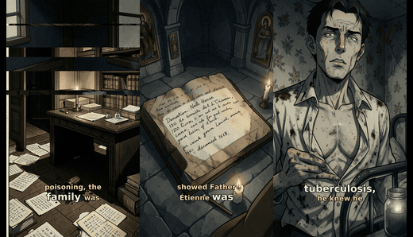
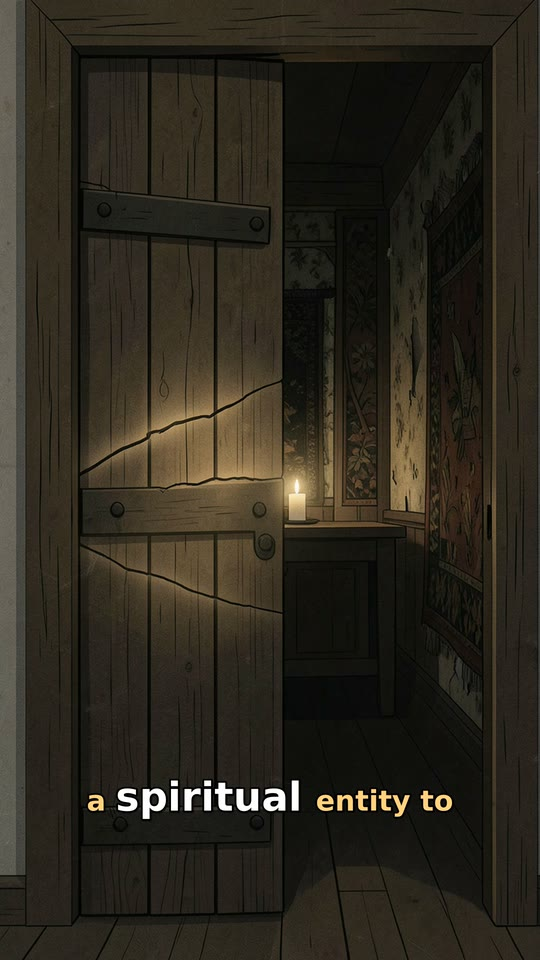
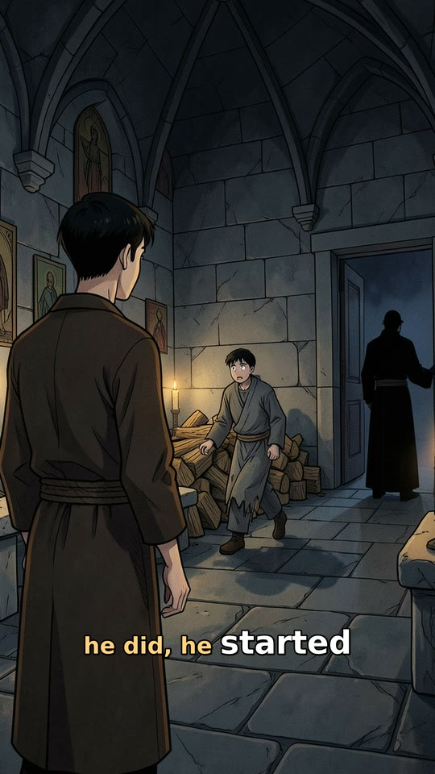
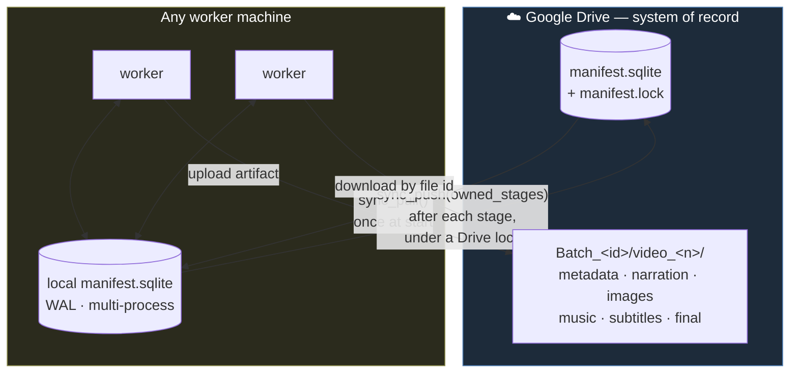
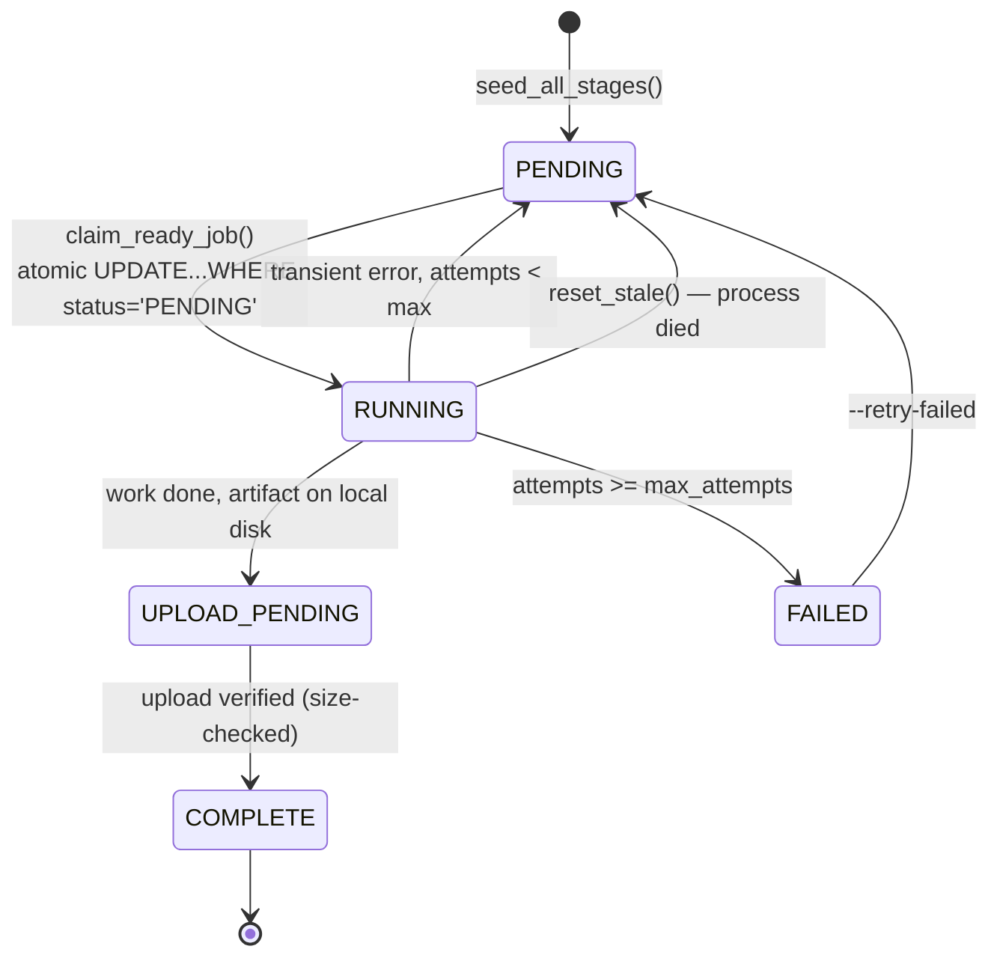
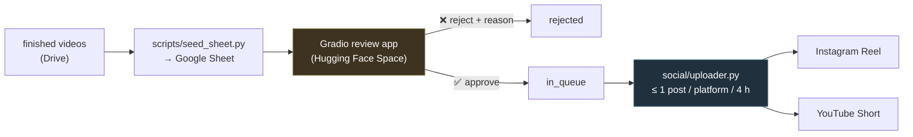

<div align="center">

# ContentFactory

**An autonomous, distributed pipeline that turns a random creative seed into a finished, publishable vertical short — story, voice, art, score, and edit — with no human in the loop until the review step.**



*Three unrelated videos, each generated end-to-end by the pipeline. Nothing here was written, drawn, voiced, scored, or edited by a person.*

<br/>

[](https://github.com/DamnKuldeep/ContentFactory/actions/workflows/ci.yml)
[](LICENSE)


`Python` · `PyTorch` · `FLUX.2` · `Fish Speech S2 Pro` · `WhisperX` · `ACE-Step 1.5` · `Qwen2.5-Omni` · `FFmpeg` · `SQLite` · `Google Drive API` · `Gradio`

[Results](#results) · [How it works](#how-it-works) · [Architecture](#architecture) · [Engineering highlights](#engineering-highlights) · [Performance](#performance) · [Run it](#run-it) · [Docs](#documentation)

</div>

---

## What this is

A **five-stage generative media pipeline**. Each stage is an independent worker pool that claims a job,
runs one model, writes its artifact to Google Drive, and records the result in a shared SQLite manifest.

```
random creative seed → story → spoken script → scene plan → image prompts
                             → narration audio + character-level alignment
                             → one illustration per scene
                             → an original score that tracks the narration's energy
                             → a cut, subtitled, mixed 1080×1920 MP4
                             → human review queue → throttled auto-publish
```

The hard problem here is not "call an image model." It is that **five different model stacks with
conflicting dependencies, none of which fit in one GPU at once, have to hand work to each other across
machines, survive crashes and flaky networks, and stay in perfect audio-visual sync** — at a cost per
video you can actually state in GPU-seconds.

That is what this repository is: the orchestration, the state machine, the data contracts, the
memory management, and the measurements that make that work.

<table>
<tr>
<td width="25%" align="center"><b>~9,100</b><br/>lines of production Python</td>
<td width="25%" align="center"><b>5</b><br/>model stacks orchestrated</td>
<td width="25%" align="center"><b>100</b><br/>video batch run in production</td>
<td width="25%" align="center"><b>~375 → ~285</b><br/>GPU-seconds per video<br/>(measured, then optimized)</td>
</tr>
</table>

---

## Results

Five finished videos, straight out of the pipeline — **click a thumbnail to play it on GitHub.**
Each is 1080×1920, ~90–100 seconds, 28–40 scenes, with per-word karaoke subtitles and an original score.

<table>
<tr>
<td align="center" width="20%">
<a href="docs/media/samples/sample_1.mp4"></a><br/>
<a href="docs/media/samples/sample_1.mp4"><b>Sample 1</b></a><br/><sub>1:40 · ink-wash style</sub>
</td>
<td align="center" width="20%">
<a href="docs/media/samples/sample_2.mp4"></a><br/>
<a href="docs/media/samples/sample_2.mp4"><b>Sample 2</b></a><br/><sub>1:35 · cel-shaded</sub>
</td>
<td align="center" width="20%">
<a href="docs/media/samples/sample_3.mp4"></a><br/>
<a href="docs/media/samples/sample_3.mp4"><b>Sample 3</b></a><br/><sub>1:32 · muted comic</sub>
</td>
<td align="center" width="20%">
<a href="docs/media/samples/sample_4.mp4"></a><br/>
<a href="docs/media/samples/sample_4.mp4"><b>Sample 4</b></a><br/><sub>1:33 · low-key noir</sub>
</td>
<td align="center" width="20%">
<a href="docs/media/samples/sample_5.mp4"></a><br/>
<a href="docs/media/samples/sample_5.mp4"><b>Sample 5</b></a><br/><sub>1:37 · soft line-art</sub>
</td>
</tr>
</table>

> The in-repo copies are downscaled to 540×960 to keep the clone small.
> **[▶ Full-resolution 1080×1920 originals on Google Drive](https://drive.google.com/drive/folders/1lbGwujEgAfGrJiuR9XZ7fJmmGF2hBxvV?usp=drive_link)**

**What to look for** — these are the outputs of specific engineering decisions, not model defaults:

| In the video | Why it looks/sounds like that |
|---|---|
| Subtitles land exactly on the spoken word | Character-level forced alignment (WhisperX) is projected back onto the *script* through a difflib mapper, so mispronunciations don't drift the timing |
| Images change exactly on the narrative beat | Every scene carries `char_start`/`char_end` offsets into the script; scene cuts are computed from the alignment, not from a fixed duration |
| One consistent art style across 34 images | A style anchor + palette + character/setting sheets are locked in stage 1 and injected into every image prompt |
| Music swells where the voice does | The score is generated from an RMS **energy envelope** extracted from the finished narration, then re-refined against the music model's own chosen BPM/key |
| Music never fights the voice | BGM is set to a fixed ratio of the narration's **measured LUFS**, then sidechain-ducked — not a hardcoded volume |
| Motion that isn't a slideshow | Bounds-guarded Ken Burns + `xfade` transitions whose type is graded by each scene's energy tier |

### Production run

The pipeline was run as a **100-video batch** across three machines. 88 of 100 stories completed;
the last 12 failed at stage 1 on an OpenRouter **spend limit** (a billing ceiling, not a code failure)
and were left queued — the manifest records them as `FAILED` and any machine can resume them with
`--retry-failed`. Full log: **[docs/RESULTS.md](docs/RESULTS.md)**.

---

## How it works

```mermaid
flowchart LR
    subgraph M1["Machine 1 · CPU"]
        S1["<b>1 · STORY</b><br/>convergence harness<br/>Llama-3.3-70B<br/>Qwen3-VL-32B<br/>Gemma-4-31B"]
    end

    subgraph M2["Machine 2 · one 24 GB GPU, sequential"]
        S2["<b>2 · NARRATION</b><br/>Fish S2 Pro NF4<br/>+ WhisperX"]
        S3["<b>3 · IMAGES</b><br/>FLUX.2-klein-4B"]
        S4["<b>4 · MUSIC</b><br/>Qwen2.5-Omni<br/>+ ACE-Step 1.5"]
    end

    subgraph M3["Machine 3 · CPU / NVENC"]
        S5["<b>5 · COMPOSE</b><br/>FFmpeg"]
    end

    SEED(["random<br/>creative seed"]) --> S1
    S1 -->|"stage_01.json<br/>story · script · 28-40 scenes"| S2
    S2 -->|"narration.mp3<br/>+ char alignment"| S3
    S3 -->|"scene_001..NNN.png"| S4
    S4 -->|"music.mp3"| S5
    S5 --> OUT(["final.mp4<br/>1080×1920"])
    OUT --> REV["human review<br/>Gradio + Google Sheet"]
    REV -->|approved| PUB["throttled publish<br/>Instagram · YouTube"]

    style SEED fill:#2b2b3d,stroke:#6c6c8a,color:#fff
    style OUT fill:#1f3d2b,stroke:#4a8a63,color:#fff
    style REV fill:#3d3320,stroke:#8a7340,color:#fff
    style PUB fill:#20303d,stroke:#40708a,color:#fff
```



Every stage reads the previous stage's JSON, enriches it, and writes its own artifact back.
**Stages find their inputs by Drive file ID recorded in the manifest — never by folder path** — so the
folder layout is purely organizational and a machine downloads only the bytes it actually needs.

### The five stages

| # | Stage | What it actually does | Engine | Output |
|---|-------|----------------------|--------|--------|
| 1 | **story** | Samples a random combination of 7 creative axes (era × region × domain × milieu × motif × flavor × structure) → an LLM turns it into a coherent direction → ideation → an adaptive interview between an "amateur" and an "expert" persona → drafts the story → a **critic jury from a different model family** scores it → surgical revision loops → spoken script → segmentation into 28–40 beats (verbatim by construction) → visual style selection → scene plan → one FLUX prompt per scene, each reviewed and rewritten | OpenRouter: Llama-3.3-70B (prose), Qwen3-VL-32B (visual), Gemma-4-31B (judges) | `stage_01.json` |
| 2 | **narration** | Splits the script into sentence chunks (Fish's 4096-token context can't hold 100 s of speech), generates each chunk independently against a fixed reference voice, concatenates, then force-aligns with WhisperX and maps the timings back onto the script characters | Fish Speech S2 Pro (NF4 4-bit) + WhisperX — or ElevenLabs, same contract | `narration.mp3` + char-level alignment |
| 3 | **images** | Loads FLUX.2 once, picks batch size from available VRAM, renders every scene prompt, and uploads in a background thread so the GPU never idles on I/O | FLUX.2-klein-4B (diffusers) | `scene_001.png …` |
| 4 | **music** | Extracts an RMS energy envelope from the narration → Qwen writes an ACE-Step brief that tracks that arc → ACE-Step renders and returns the BPM/key it chose → Qwen verifies its own brief against that blueprint and emits a refined one → re-render | Qwen2.5-Omni-7B + ACE-Step 1.5 | `music.mp3` + brief/verification |
| 5 | **compose** | Ken Burns with bounds-guarded crop, energy-graded `xfade` transitions, per-word rolling karaoke subtitles (ASS), loudness-relative BGM mix with sidechain ducking, NVENC encode | FFmpeg | `final.mp4` |

Per-stage hardware and throughput runbooks: **[docs/deployment/](docs/deployment/)**.

---

## Architecture

### Google Drive is the system of record

Local disk is scratch. Every artifact and **the job database itself** live in Drive, so machines are
disposable — a node can die mid-batch and another picks up exactly where it left off.



The trick is that **the hot path never touches Drive**. Workers run against a local SQLite file at full
speed with zero per-job network I/O. The orchestrator pulls the shared DB once at start and pushes
*only its own stage's rows* after each stage, under a best-effort Drive mutex. Because each machine
owns **disjoint stages**, the merge is conflict-free by construction.

### Job lifecycle



A stage-N job becomes claimable only when the same story's stage-(N−1) job is `COMPLETE`, expressed as
a single SQL `EXISTS` sub-query. That one predicate is the entire scheduler: workers need no batch IDs,
no coordinator, and no message queue — `python scripts/worker.py images` just drains everything that is
ready, anywhere in the DB.

### Data contract

One JSON document accretes down the chain. Each stage appends under `meta.stage_0N` and re-uploads the
whole thing, so any stage can be re-run from any machine with only a Drive file ID.

```
stage_01.json ──► + alignment          ──► + meta.stage_03.images[]  ──► + meta.stage_04  ──► + meta.stage_05
                    meta.stage_02          (drive_file_id per scene)      music_drive_id      video_drive_id
```

The `alignment` object — one start/end timestamp **per character of the script** — is the spine of the
whole system. Scene timings, subtitle word timings, and the music's target duration are all derived
from it. Correct alignment is correct sync; everything downstream is engine-agnostic because Fish and
ElevenLabs both return this identical shape.

Full design notes, module-by-module: **[docs/ARCHITECTURE.md](docs/ARCHITECTURE.md)**.

---

## Engineering highlights

The parts that were genuinely hard, and what the fix was.

<details open>
<summary><b>Keeping subtitles in sync with a TTS engine that mispronounces things</b></summary>

Fish generates audio per chunk; WhisperX then transcribes what was *actually said*. Those two word
sequences don't match — the model swallows a syllable, renders "Chacabuco" as three words, or drops a
filler. Naively zipping heard-words to script-words drifts the whole video out of sync.

`stages/stage_02_narration/fish.py` runs a `difflib.SequenceMatcher` between normalized heard tokens and
normalized script tokens, propagates timings across `equal` blocks, **linearly interpolates across
`replace` blocks**, back-fills unmatched runs between known anchors, then enforces monotonicity before
expanding word timings down to per-character resolution. The result is robust to ASR drift and produces
the exact same contract ElevenLabs' paid API returns.
</details>

<details>
<summary><b>Three model stacks that don't fit in 24 GB — or in the same virtualenv</b></summary>

Fish, FLUX.2, and ACE-Step have conflicting dependency pins, so each stage gets **its own virtualenv**
provisioned by its own `scripts/setup_*.py`, sharing one repo-local HuggingFace cache so 40+ GB of
weights are downloaded once.

VRAM is managed explicitly: stage 3 picks its batch size from `torch.cuda.get_device_properties`, and
stage 4 **frees Qwen from VRAM before ACE-Step loads** (`free_qwen()`) because the two don't co-fit on a
24 GB card. `BGM_TWO_PASS=0` exists for the same reason.
</details>

<details>
<summary><b>Music that follows the narration instead of sitting under it</b></summary>

Two ideas compose here. First, **grounding**: `shared/narration_features.py` extracts a librosa RMS
energy envelope from the finished narration and describes it in words, so the music brief is written
against the actual dynamics of the voice track. Second, **verification**: ACE-Step returns the BPM and
key its own language-model planner chose; that blueprint is fed *back* to Qwen, which critiques its own
pass-1 brief against it and emits a refined one for a second render.

At mix time the music is not set to a magic number — `shared/audio.py` measures the narration's LUFS
and places the BGM at `BGM_LOUDNESS_RATIO ×` that loudness, then sidechain-compresses it against the
voice. Loud narration gets proportionally louder music; the balance is stable across every video.
</details>

<details>
<summary><b>Crash-safety on a flaky uplink (three real production bugs)</b></summary>

Running this for real surfaced failures that don't appear in a demo:

- **`SIGSEGV` (rc=139) in the image worker.** Concurrent resumable Drive uploads raced inside OpenSSL
  and killed the process with no traceback. Fixed by serializing the upload pool to one worker — which
  still overlaps upload with the *next* generation batch, so the throughput win is kept.
- **Same crash in stage 5.** The Drive `service` object is httplib2-backed and **not thread-safe**;
  sharing it across a download pool produced 0-byte files and segfaults. Downloads are now serial with
  retries.
- **Two workers rendering the same story.** `claim_job` selected then updated without a guard. Now the
  claim is `UPDATE … WHERE id=? AND status='PENDING'` and the winner is decided by `rowcount`, with the
  loser retrying — a compare-and-swap in one statement.

Every upload is size-verified against the local file and deleted-and-retried on mismatch; stage 3 lists
the Drive folder on start and skips scenes it already uploaded, so an interrupted 34-image render
resumes instead of restarting.
</details>

<details>
<summary><b>An LLM harness that argues with itself</b></summary>

Stage 1 is not a prompt — it's a **convergence harness** (`stages/stage_01_story/`, ~1,500 lines).
Generators, critics, and judges are deliberately drawn from **different model families** to avoid
self-preference bias: Llama-3.3 writes the prose, Gemma-4 judges it, Qwen3-VL plans the visuals, and
Llama-3.3 judges *those*. Critic lanes that pass are retired from later rounds; the showrunner step is
skipped entirely when every lane is already satisfied and the draft is in its length band, so a good
draft is never rewritten into a worse one.

Script segmentation is the subtle part: the LLM proposes *cut indices*, and the code re-slices the
original script at those boundaries. The narration is therefore **verbatim by construction** — the model
cannot paraphrase the script even if it tries — with a deterministic split/merge backstop that enforces
the 28–40 beat band.
</details>

<details>
<summary><b>Multi-machine auth with no browser</b></summary>

Headless GPU boxes can't complete an OAuth consent flow, and a worker that opens a browser mid-batch
hangs forever. `shared/drive.py` is **refresh-only**: it loads a copied `token.json`, refreshes silently,
and structurally cannot call `run_local_server`. Interactive authorization lives in exactly one place
(`scripts/drive_auth.py`) and is run once, on a laptop. Desktop-client refresh tokens aren't
machine-bound, so the same token file works on every node.
</details>

---

## Performance

Measured end-to-end on one video (34 scenes, 88.5 s narration) on an RTX 5090 Laptop (24 GB), with a
`PROFILE_LOG` instrumentation layer (`shared/timing.py`) that records every step as JSONL.

| Stage | Wall | GPU-s | Dominant cost |
|---|---:|---:|---|
| 1 · story (API only) | 819 s | 0 | LLM convergence loops |
| 2 · narration | 187 s | ~170 | `tts_generate` 128 s · model load 40 s |
| 3 · images | 267 s | ~121 | 9 × FLUX batches ~115 s · 34 serial uploads ~125 s (GPU idle) |
| 4 · music | 83 s | ~81 | Qwen brief 36 s · ACE load 22 s |
| 5 · compose | 119 s | ~0 | asset download 59 s · frames 20 s · NVENC 23 s |
| **Total** | **24.6 min** | **~375 GPU-s** | loads 84 s · inference 292 s |

Then a **controlled A/B** (2 matched arms × 3 videos) on the two available levers:

| Lever | Result | Verdict |
|---|---|---|
| `FISH_COMPILE` (torch.compile on the TTS decode step) | 138 s → 60 s per video — **2.1× faster** | ✅ ship it |
| `FLUX_COMPILE=default` | 13.5 s → 11.0 s per batch — **18% faster** | ✅ ship it |
| `FLUX_COMPILE=reduce-overhead` | CUDA graphs reserve +2.7 GB → **OOM after ~20 images** | ❌ never on 24 GB |
| `LLM_PROMPT_CACHE` | control arm *already* 17% cached — providers auto-cache regardless | ❌ measured no-op, left off |

**Net: ≈90 GPU-seconds saved per video (~24%)**, essentially all of it from `FISH_COMPILE`. Because
`torch.compile` pays a one-time build cost per process, this is a *batch* optimization — which is exactly
why the bulk path (`scripts/worker.py <role>`) loads its model once and drains every ready video rather
than spawning per-job.

Reproduce: `PROFILE_LOG=run.jsonl python scripts/worker.py <role>`, then
`python scripts/profile_report.py run.jsonl`. Method and raw numbers:
**[docs/PERFORMANCE.md](docs/PERFORMANCE.md)** · **[bench/AB_FINDINGS.md](bench/AB_FINDINGS.md)** ·
**[docs/latency_report.md](docs/latency_report.md)**.

---

## Review & publishing

Generation is only half of it — a fully automatic feed with no gate is a liability, so the last mile is
deliberately **human-in-the-loop**.



A Google Sheet is the single source of truth for review state, which means reviewers need no accounts,
no database, and no VPN. The uploader is throttled and idempotent — it resumes from the Sheet, so
running it intermittently on a laptop is fine. Captions and hashtags are generated per video from the
story's own logline and script. Details: **[docs/PUBLISHING.md](docs/PUBLISHING.md)**.

---

## Repository layout

```
ContentFactory/
├── run.py                     # orchestrator CLI — --stage / --stages / --resume / --list-videos
├── shared/                    # the reusable core
│   ├── manifest.py            #   SQLite job DB: atomic claim, readiness, retries, video catalog
│   ├── drive_db.py            #   Drive-hosted shared DB: checkpoint sync + best-effort Drive mutex
│   ├── drive.py               #   Drive client: refresh-only OAuth, per-video folders, verified upload
│   ├── llm.py                 #   OpenRouter client: retries, JSON repair, live cost meter
│   ├── subtitles.py           #   per-word rolling karaoke ASS builder
│   ├── audio.py               #   LUFS measurement, loudness-relative BGM gain
│   ├── narration_features.py  #   RMS energy envelope + pacing features
│   ├── video_fx.py            #   Ken Burns crop expressions, energy-graded transition picker
│   ├── timing.py              #   PROFILE_LOG instrumentation (every measurement in this README)
│   └── worker.py  config.py  utils.py  progress.py  rate_limiter.py  log.py
├── stages/
│   ├── stage_01_story/        # convergence harness: pipeline · convergence · prompts · models · config
│   ├── stage_02_narration/    # fish.py (Fish + WhisperX + difflib mapper) · pipeline.py (ElevenLabs)
│   ├── stage_03_images/       # FLUX.2 generation with VRAM-aware batching + overlapped upload
│   ├── stage_04_music/        # brief.py (Qwen, two-pass) · ace.py (ACE-Step)
│   └── stage_05_compose/      # compose.py (the FFmpeg filter graph)
├── scripts/                   # ops: produce · worker · setup_* · drive_auth · reset_pipeline · profile_*
├── social/                    # review Sheet + metadata generation + Instagram/YouTube adapters
├── review_app/                # Gradio review queue (deployable to a free HF Space)
├── tests/                     # the job state machine + alignment→subtitle transforms (32 tests, no GPU)
├── bench/                     # the A/B harness and its findings
├── research/                  # R&D provenance: the experiment scripts the production logic came from
└── docs/                      # architecture · runbook · performance · results · deployment
```

Tests cover the two things that must not be wrong — the scheduler's guarantees (a stage cannot start
before its predecessor finished; a job cannot be claimed twice; failures retry a bounded number of
times) and the alignment→subtitle transforms that produce on-screen sync. They need no GPU, no network
and no credentials, and run in under a second:

```bash
python -m unittest discover -s tests -v
```

---

## Run it

**Prerequisites** — Python 3.10+, an NVIDIA GPU (24 GB recommended) for stages 2–4, `ffmpeg` for stage 5,
an OpenRouter API key, and a Google OAuth desktop client.

```bash
git clone https://github.com/DamnKuldeep/ContentFactory.git && cd ContentFactory
cp .env.example .env          # fill in your key + Drive folder id

# One-time, on a machine with a browser — writes token.json.
# Copy credentials.json + token.json to every other machine; they never re-authenticate.
python scripts/drive_auth.py
```

**Provision each node** (per-stage venvs are intentional — the dependency sets genuinely conflict):

```bash
python scripts/setup_story.py      # ../.venv_story
python scripts/setup_narration.py  # ../.venv_narration  → Fish S2 Pro + WhisperX
python scripts/setup_images.py     # ../.venv_images     → FLUX.2-klein
python scripts/setup_bgm.py        # ../.venv_bgm        → Qwen2.5-Omni (+ validates ACE-Step)
python scripts/setup_compose.py    # ../.venv_compose    → needs system ffmpeg
```

**Bulk mode** — seed once, then run one draining worker per role. No batch IDs, no coordinator:

```bash
# CPU box: seed 150 videos across all stages and generate the stories
python scripts/produce.py --count 150

# GPU box: each role loads its model once and drains every ready video, then exits
source ../.venv_narration/bin/activate && python scripts/worker.py narration
source ../.venv_images/bin/activate    && python scripts/worker.py images
source ../.venv_bgm/bin/activate       && python scripts/worker.py music

# CPU box: compose
source ../.venv_compose/bin/activate   && python scripts/worker.py compose

# Read the finished-video catalog (also exports videos.csv/json to Drive)
python run.py --list-videos
```

**Staged mode** — explicit per-stage control, useful for a single machine or a partial re-run:

```bash
python run.py --stage 1 --count 5 --drive-db        # prints a batch id
python run.py --stages 2 3 4 --batch <id> --drive-db
python run.py --stage 5 --batch <id> --drive-db
python run.py --resume --stages 4 5 --batch <id>    # pick a batch up on any machine
```

Everything is idempotent and resumable: re-running a worker claims only what's left, interrupted jobs
are auto-reset after a timeout, and `--retry-failed` requeues permanent failures.
Full runbook, toggles, and troubleshooting: **[docs/RUNME.md](docs/RUNME.md)**.

---

## Documentation

| Doc | What's in it |
|---|---|
| **[docs/ARCHITECTURE.md](docs/ARCHITECTURE.md)** | System design, all five stages, `shared/` module reference, data contracts, the distributed Drive-DB model, known limitations |
| **[docs/RUNME.md](docs/RUNME.md)** | Operations: node provisioning, one-time auth, `.env`, every run mode, resume/retry, reset, troubleshooting |
| **[docs/PERFORMANCE.md](docs/PERFORMANCE.md)** | Latency/GPU-cost baseline, every optimization lever with its measured result, bugs found while profiling |
| **[docs/RESULTS.md](docs/RESULTS.md)** | The sample videos and the 100-video production run |
| **[docs/PUBLISHING.md](docs/PUBLISHING.md)** | Review queue, the Google Sheet schema, throttled Instagram/YouTube publishing |
| **[docs/deployment/](docs/deployment/)** | Per-stage hardware, throughput, and troubleshooting runbooks |
| **[bench/AB_FINDINGS.md](bench/AB_FINDINGS.md)** | The controlled A/B: method, raw numbers, and what was rejected |

---

## Notes & limitations

Stated plainly, because they're real:

- **The narration voice occasionally mispronounces proper nouns.** That's TTS quality, independent of
  the alignment work — the subtitles still land on the right word.
- **Checkpoint sync assumes one machine per stage.** Running the *same* stage on two machines
  concurrently is outside the concurrency envelope; the Drive lock is best-effort (Drive has no atomic
  compare-and-swap) and is sized for a small fleet, not hundreds of writers.
- **Stage 1 costs real money** (~$0.10/video in LLM calls at the measured rates). Stages 2–5 are local.
- **The Instagram adapter uses `instagrapi`**, which is unofficial and against Instagram's ToS. It's
  there for completeness, throttled to human pace, and should be pointed at a burner account. The
  YouTube adapter uses the official Data API.
- **Content is fictional by design** — the story prompt explicitly forbids defaming real, named, living
  people and bans identity-based atrocity as story material.

## License

MIT — see [LICENSE](LICENSE).
