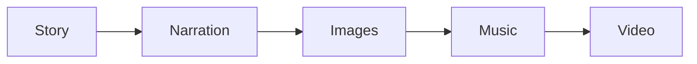
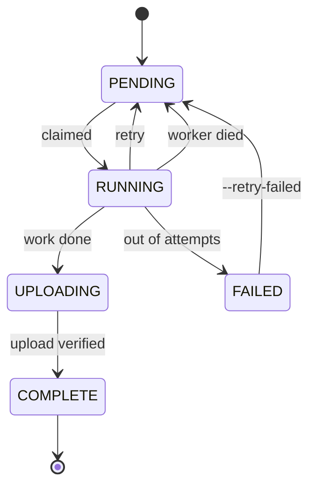

# How it's built

The design, the data that flows between stages, and how multiple machines share work.

> The [README](../README.md) has an illustrated walkthrough of what happens inside each stage — the
> critic loops, the alignment mapping, the two-pass music. This doc is the reference underneath it:
> module by module, contract by contract. To actually run things, see [RUNME.md](RUNME.md).

1. [The shape of it](#the-shape-of-it)
2. [The five stages](#the-five-stages)
3. [What's in `shared/`](#whats-in-shared)
4. [The data that moves between stages](#the-data-that-moves-between-stages)
5. [How jobs get scheduled](#how-jobs-get-scheduled)
6. [Multiple machines](#multiple-machines)
7. [Review and posting](#review-and-posting)
8. [scripts, bench, research](#scripts-bench-research)
9. [Where it falls over](#where-it-falls-over)

---

## The shape of it

Five stages turn a random idea into a 1080×1920 video.



Every stage does the same four things: claim a job, download what it needs, do its work, upload the result and write down where it went.

Local disk is scratch. Drive holds the artifacts *and* the job database, which is what lets machines be disposable.

There are two ways to run it:

**Bulk** — `scripts/produce.py` seeds every stage at once, then `scripts/worker.py <role>` on each machine drains everything ready for that role. No batch IDs, no coordinator. This is the production path, and it's also the only way `torch.compile` pays off, since the model gets loaded and compiled once per process instead of once per job.

**Staged** — `run.py --stage N` gives you explicit control: worker pools, a live progress view, one stage at a time. Better for a single machine or re-running one piece.

---

## The five stages

| Stage | What it produces | Using |
|---|---|---|
| `stage_01_story` | `stage_01.json` — story, script, 28–40 scenes, character/setting sheets, style | Llama 3.3 70B, Qwen3-VL 32B, Gemma 4 31B via OpenRouter |
| `stage_02_narration` | `narration.mp3` plus a timestamp for every character of the script | Fish Speech S2 Pro (4-bit) + WhisperX, or ElevenLabs |
| `stage_03_images` | `scene_001.png` … one per scene | FLUX.2-klein-4B |
| `stage_04_music` | `music.mp3` plus the brief that made it | Qwen2.5-Omni-7B + ACE-Step 1.5 |
| `stage_05_compose` | `final.mp4` | FFmpeg, NVENC if it's there |

### Story

This one's the biggest, about 1,500 lines across `pipeline.py`, `convergence.py`, `prompts.py`, `models.py` and `config.py`. It goes:

```
roll 7 creative dice  →  turn them into a coherent direction  →  come up with 7 premises
  →  judge them, pick one  →  interview an "expert" about it  →  write the story
  →  critics score it, revise, repeat  →  write the spoken script  →  same again
  →  pull out characters and settings  →  cut the script into 28-40 beats
  →  pick a visual style  →  plan the scenes  →  judge and fix the plan
  →  write an image prompt per scene  →  review and rewrite the bad ones
```

Three decisions in there worth explaining:

**Critics come from a different model family than the writer.** A model grading its own output is far too generous. So Llama writes prose and grades Qwen's scene plans, Gemma grades Qwen's image prompts, and Qwen-VL stays off text critique entirely — its verdicts on prose were unusable.

**The script can't be paraphrased.** The segmenter doesn't rewrite the script into beats. It gets a list of clause-level chunks and returns *which chunk numbers end a beat*. The code then slices the original script at those points. A deterministic splitter fixes the count afterward and enforces 5–24 words a beat. So the narration is identical to the script no matter what the model does.

**A good draft is left alone.** If every critic is satisfied and the length is in range, the final rewrite step is skipped. Rewriting a draft that's already working usually makes it worse.

### Narration

Whichever engine you pick, you get back the same thing: `{characters, character_start_times_seconds, character_end_times_seconds}`. Stages 4 and 5 never need to know which one ran.

The Fish path is the interesting one. Fish's context is 4096 tokens, which can't hold 100 seconds of speech, so the script is split into sentence-sized chunks and each is generated on its own against a fixed reference voice, then concatenated. WhisperX force-aligns the result.

But WhisperX transcribes what Fish *actually said*, and that's not the script. So `fish.py` runs a `difflib` diff between the two word lists and:

- copies timings straight across wherever the words match,
- interpolates evenly across stretches where they don't,
- fills any remaining gaps between the nearest known anchors,
- forces everything to move forward in time,
- then spreads word timings down to individual characters.

That last step is what makes per-word subtitles and beat-accurate cuts possible.

### Images

Loads FLUX once per process, reads the GPU's memory to pick a batch size, renders each prompt, and uploads on a background thread so the GPU isn't sitting idle waiting for the network.

One background thread, not four. Four raced inside OpenSSL and killed the process. One still overlaps with the next batch, which was the whole point.

It also lists the Drive images folder before starting and skips anything already there, so an interrupted 34-image render picks up where it stopped.

### Music

Two passes, both grounded in the actual narration:

1. Pull an RMS energy curve out of the finished voice track and describe it in words.
2. Qwen writes an ACE-Step brief against that description — instruments, mood, BPM, key, volume — and the values get clamped to what ACE-Step accepts.
3. ACE-Step renders, and hands back the BPM and key *its own* planner picked.
4. Qwen sees its own brief next to what ACE-Step actually did, criticises itself, and writes a better one. Render again.

Qwen gets evicted from VRAM before ACE-Step loads. They don't fit together on 24 GB, which is also why `BGM_TWO_PASS=0` exists as an escape hatch.

### Compose

One big FFmpeg filter graph:

- **Ken Burns** — a crop expression panning across an oversized frame, eight rotating directions, bounds-guarded so it can't run off the edge.
- **Transitions** — each scene gets an energy score and the transition type is picked to match. Duration is capped at 60% of the shortest scene so nothing gets swallowed.
- **Subtitles** — one ASS line per *word state*. A four-word window slides along; the current word is white and slightly bigger, the rest are gold. Lines butt up exactly against each other so there's no flicker.
- **Audio** — measure the narration's LUFS, set the music to a fraction of that, fade it out, sidechain-compress it against the voice, mix.
- **Encode** — `h264_nvenc` if available, `libx264 -crf 20` otherwise.

Scene times come out of the alignment: a scene knows its character range, and that maps to a start and end time. Each scene's end is snapped to the next one's start so there are no gaps. If stage 1 didn't write character offsets, `_add_char_positions()` finds each scene's narration inside the script and works them out.

---

## What's in `shared/`

| File | What it's for |
|---|---|
| `config.py` | Reads `.env`, holds every setting. Sets `HF_HOME` before anything imports HuggingFace. |
| `manifest.py` | The job database. Claiming, readiness, retries, stale recovery, the finished-video catalog. |
| `drive_db.py` | Syncing that database through Drive, plus a Drive-file-based lock. |
| `drive.py` | Drive client. Refresh-only auth, per-video folders, size-verified uploads, retries. |
| `worker.py` | The worker loop: claim, run, save, upload, mark done, or fail. |
| `llm.py` | OpenRouter with retries, JSON repair when a model returns something malformed, and a cost meter. |
| `audio.py` | LUFS measurement, working out the BGM level, ffmpeg tempo chains. |
| `subtitles.py` | Building the rolling karaoke ASS file and turning alignment into words. |
| `narration_features.py` | The energy curve and pacing numbers the music is built on. |
| `video_fx.py` | Ken Burns maths, transition picking, image fitting. |
| `timing.py` | The profiler. A no-op unless `PROFILE_LOG` is set; every number in [PERFORMANCE.md](PERFORMANCE.md) came from it. |
| `utils.py` | Paths, slugs, environment checks. |
| `progress.py` | The live progress dashboard. |
| `rate_limiter.py` | Cross-process 429 backoff. |

---

## The data that moves between stages

One JSON document grows as it goes down the chain. Each stage adds its bit and re-uploads the whole thing.

```
stage_01.json
    + alignment, meta.stage_02        (narration)
    + meta.stage_03.images[]          (image file ids)
    + meta.stage_04.music_drive_id    (music)
    + meta.stage_05.video_drive_id    (final video)
```

Two things about it matter.

**Stages find their inputs by Drive file ID, never by path.** The folder layout is for humans. A machine downloads exactly the bytes it needs and nothing else.

**The `alignment` object is the spine.** One start and end time per character of the script. Scene cuts, subtitle timing and the music's target length all come out of it. If the alignment is right the video is in sync; if it's wrong nothing else can save it.

One wrinkle worth knowing: stages 3, 4 and 5 branch off the stage-1 document, so they don't automatically carry stage 2's alignment. Stages 4 and 5 explicitly go and fetch the stage-02 JSON and merge it in. That was a real bug — found the first time the chain ran all the way through.

---

## How jobs get scheduled



**Claiming is a compare-and-swap.** Pick a candidate row, then:

```sql
UPDATE jobs SET status='RUNNING' WHERE id=? AND status='PENDING'
```

Exactly one process sees `rowcount == 1`. Everyone else gets 0 and tries again in a fresh transaction, so they see the winner's commit. Before this guard, two workers rendered the same story — double the GPU time for one video.

**Readiness is one query.** A job is claimable when the same story's previous stage says `COMPLETE`:

```sql
SELECT j.id FROM jobs j
WHERE j.stage=? AND j.status='PENDING' AND EXISTS (
  SELECT 1 FROM jobs p
  WHERE p.batch_id=j.batch_id AND p.story_num=j.story_num
    AND p.stage=? AND p.status='COMPLETE')
ORDER BY j.batch_id, j.story_num LIMIT 1
```

That's the whole scheduler for the bulk path. No queue, no coordinator, no batch IDs to pass around. It's also why a story that failed in stage 1 quietly never appears downstream instead of needing to be excluded by hand.

Interrupted `RUNNING` jobs get released back to `PENDING` after a timeout. `--retry-failed` puts dead ones back in. Stage 3 additionally skips images already sitting in Drive.

---

## Multiple machines

### Authorising once and never again

A headless GPU box can't complete an OAuth consent screen, and a worker that tries to open a browser mid-batch hangs there until you notice. So the browser flow isn't in the worker's code path at all — `_oauth_service` loads a token from disk and refreshes it, and that's it. The interactive flow lives in exactly one file, `scripts/drive_auth.py`, which you run once on a laptop.

Desktop OAuth refresh tokens aren't tied to a machine, so you copy `credentials.json` and `token.json` around and every box just works.

### Folder layout

```
<your Drive folder>/
    manifest.sqlite          the shared job database
    manifest.lock            the lock file
    videos.csv / .json       exported catalog
    Batch_<id>/
        video_0001/
            metadata/  narration/  images/  music/  subtitles/  final/
        video_0002/
            ...
```

### Sharing the database

The database is the source of truth across machines, but touching Drive on every job would be miserably slow. So:

```
  Drive: manifest.sqlite
      │                    ▲
      │ pull once          │ push after each stage,
      │ at startup         │ under a short lock
      ▼                    │
  local manifest.sqlite  ──┘
      ▲
      │  workers read and write this, full speed, no network
   worker  worker  worker
```

Workers only ever hit the local file. The orchestrator pulls at startup, and after each stage pushes back **only the rows for stages this machine owns** — delete-then-insert on the unique key. Since each machine owns different stages, two machines' pushes can never conflict.

The push retries the whole lock-pull-merge-upload block up to five times, because the merge is idempotent and a dropped TLS connection halfway through shouldn't kill a batch.

The lock is a file in the Drive folder. Drive has no atomic compare-and-swap, so it's best-effort: create one, then check yours is the oldest; if an existing lock is older than its TTL, assume the holder crashed and take it. It's only held for a quick pull-merge-push at handoff, so contention barely exists.

**This assumes one machine per stage.** Two machines running the *same* stage at once isn't supported.

### Why not a real queue?

A message broker needs a box that's always up, credentials everywhere, and its own failure story. The whole point here was laptops that come and go. So it leans on the storage layer that was already mandatory, and keeps coordination down to one pull, one push, and one SQL predicate.

---

## Review and posting

Finished videos don't post themselves. They get seeded into a Google Sheet, reviewed through a small Gradio app, and drained to Instagram and YouTube by a throttled uploader at one post per platform per four hours.

The Sheet being the database means reviewers need no account and no backend, and anyone can inspect or fix the state by hand.

Files: `scripts/seed_sheet.py`, `social/sheet.py`, `social/metadata.py`, `social/uploader.py`, `social/ig_adapter.py`, `social/yt_adapter.py`, `review_app/app.py`. Written up in [PUBLISHING.md](PUBLISHING.md).

---

## scripts, bench, research

**`scripts/`** is the operational stuff:

| | |
|---|---|
| `produce.py` | Seed N videos across all stages and write the stories. How a bulk run starts. |
| `worker.py <role>` | Drain everything ready for one role. `--watch` to sit and wait for upstream. |
| `drive_auth.py` | The one-time browser authorisation. |
| `setup_*.py` | Build a stage's venv, install its deps, download its weights. |
| `fish_narration.py` | Standalone Fish narration. Its `ensure_setup()` is what fetches and patches the Fish repo. |
| `seed_sheet.py` | Fill the review sheet from finished videos. |
| `profile_report.py` / `profile_compare.py` | Turn a profile log into a report, or diff two runs. |
| `reset_pipeline.py` | Wipe everything. Asks first unless you pass `--yes`. |

**`bench/`** is the A/B harness — scripts that run two matched arms into an isolated Drive folder, plus what they found.

**`research/`** is where this came from. `narration_grounded_exp.py` is where the energy-curve music approach was worked out; `video_composer.py` is where the rolling subtitles, loudness mix and energy transitions started; `ace_story_grounded.py` and `run_bgm_batch.py` are earlier ACE-Step experiments. None of it is on the production path — the shipped versions live in `shared/` and the stages — but it's kept so the results are reproducible.

---

## Where it falls over

- **The TTS mispronounces proper nouns.** Doesn't affect sync, since alignment is derived from what was said and then mapped back.
- **FLUX writes gibberish** when a prompt asks for readable text in the image.
- **One machine per stage.** The sync model assumes it; the Drive lock is best-effort and sized for a handful of machines, not hundreds.
- **Stage 1 is the slow one** — around 14 minutes of LLM back-and-forth per video, and the only stage that costs money. It's also the easiest to scale, being pure API work: raise `--workers` until you hit rate limits.
- **`instagrapi` is unofficial** and against Instagram's ToS. See [PUBLISHING.md](PUBLISHING.md).
