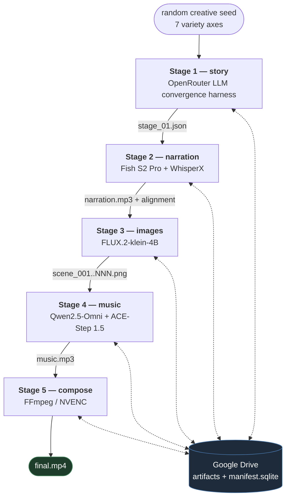
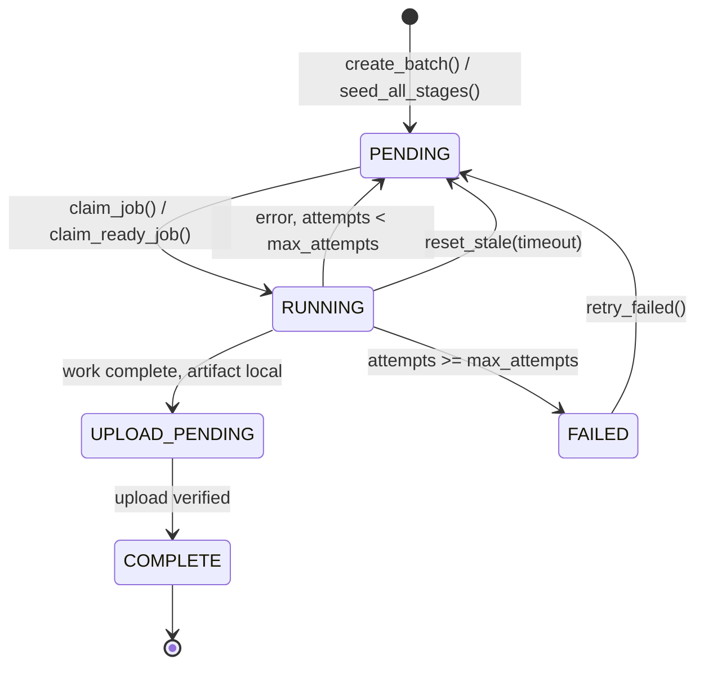

# Architecture

System design, data contracts, and the distributed execution model.

> New here? Start at the [README](../README.md), then use [RUNME.md](RUNME.md) to run it.

## Contents
1. [Overview](#1-overview)
2. [Pipeline flow](#2-pipeline-flow)
3. [The five stages](#3-the-five-stages)
4. [`shared/` modules](#4-shared-modules)
5. [Data contracts](#5-data-contracts)
6. [Orchestration & job state](#6-orchestration--job-state)
7. [Distributed design](#7-distributed-design)
8. [Review & publishing layer](#8-review--publishing-layer)
9. [`scripts/`, `bench/`, `research/`](#9-scripts-bench-research)
10. [Limitations](#10-limitations)

---

## 1. Overview

ContentFactory turns a random creative seed into a finished vertical short (1080×1920) through five
sequential stages. It is built for **ephemeral, decentralized** execution: local disk is scratch,
**Google Drive is the system of record**, and a SQLite **manifest** tracks every job's state. Each
stage is an independent worker pool that claims jobs, does its work, uploads artifacts to Drive, and
records the result.

Two execution modes:

- **Local** — one machine, local `manifest.sqlite`, artifacts optionally pushed to Drive.
- **Distributed** (`--drive-db` / `DRIVE_DB=1`) — the manifest itself lives in Drive; different machines
  run different stages and hand off through it. See [§7](#7-distributed-design).

Two operating models sit on top of that:

- **Staged** (`run.py --stage N`) — explicit per-stage control, batch IDs, worker pools, live progress
  dashboard. Best for a single machine or a targeted re-run.
- **Bulk** (`scripts/produce.py` + `scripts/worker.py <role>`) — seed every stage once, then run one
  draining worker per role. No batch IDs, no coordinator. This is the production path, and it is also
  what makes `torch.compile` pay off (the model is loaded and compiled once per *process*, not per job).

---

## 2. Pipeline flow



Each stage: **claim job → download inputs by Drive file id → work → upload artifact → record state.**

Stages locate their inputs by **file id recorded in the manifest/JSON**, never by folder path — so the
Drive folder layout is purely organizational, and a machine downloads exactly the bytes it needs.

---

## 3. The five stages

| # | Stage dir | Purpose | Model / API | Produces |
|---|-----------|---------|-------------|----------|
| 1 | `stage_01_story` | story + narration script + per-scene visual prompts | OpenRouter: Llama-3.3-70B, Qwen3-VL-32B, Gemma-4-31B via `shared.llm` | `stage_01.json` (`story`, `script`, `scenes[]`, `meta.style`, character/setting sheets) |
| 2 | `stage_02_narration` | narration audio + char-level alignment | **Fish S2 Pro (NF4) + WhisperX** (default) or **ElevenLabs** | `narration.mp3` + `job_data["alignment"]` |
| 3 | `stage_03_images` | one image per scene | FLUX.2-klein-4B (diffusers, local GPU) | `scene_001.png …` |
| 4 | `stage_04_music` | narration-grounded BGM | Qwen2.5-Omni-7B (brief) + ACE-Step 1.5 (music) | `music.mp3` + brief/verification |
| 5 | `stage_05_compose` | final video | FFmpeg (NVENC, libx264 fallback) | `final.mp4` |

### Stage 1 — story

`pipeline.py` runs a multi-loop convergence harness over `convergence.py`, `prompts.py`, `models.py`,
`config.py`:

```
sample 7 variety axes  →  compose a creative direction  →  ideate 7 premises (verbalized sampling)
  →  judge + weighted-sample a premise  →  adaptive amateur↔expert interview  →  draft the story
  →  critic jury ⇄ surgical revision (passed lanes retire)  →  showrunner
  →  blueprint interview  →  draft the spoken script  →  critic jury ⇄ revision  →  length guard
  →  extract character/setting sheets  →  segment into 28-40 beats  →  select a visual style
  →  plan scenes  →  judge ⇄ update the plan  →  write one FLUX prompt per scene (parallel)
  →  review ⇄ rewrite prompts (re-checks only what it rewrote)
```

Three design decisions matter here:

- **Anti self-preference.** The critic jury and the judges that grade a model's output are always a
  *different* model family from the generator. Llama-3.3 writes prose and judges the Qwen planner;
  Gemma-4 judges the Qwen prompt writer; Qwen-VL is kept off the text critic jury entirely (it emitted
  unusable text verdicts).
- **Verbatim-by-construction segmentation.** The LLM returns *cut indices* into a deterministic
  clause-level split, and the code re-slices the original script at those boundaries. The narration can
  therefore never be paraphrased, and a deterministic split/merge backstop enforces the beat-count band
  and 5–24 words per beat.
- **Don't rewrite a good draft.** If every critic lane is satisfied and the draft is inside its length
  band, the showrunner rewrite is skipped and the draft is kept verbatim.

`shared/llm.py` handles retries with backoff, structured-JSON repair, and a live cost meter.

### Stage 2 — narration

`pipeline.run_all()` dispatches on `config.NARRATION_ENGINE`:

- **`fish`** (default) → `fish.generate_narration_fish()`. Fish S2 Pro (NF4 4-bit) generates audio per
  sentence-chunk against a fixed reference voice — chunking is required because Fish's 4096-token
  context cannot hold a ~100 s narration — then the chunks are concatenated, WhisperX force-aligns the
  result, and a **difflib mapper** projects the heard timings back onto the script characters.
- **`elevenlabs`** → `generate_narration()`, using the `/with-timestamps` endpoint.

Both return the identical `{"alignment": {characters, character_start_times_seconds,
character_end_times_seconds}}` contract, so stages 4 and 5 are engine-agnostic.

The mapper is the interesting part. Heard words and script words don't match one-to-one (ASR drift,
mispronounced proper nouns, swallowed syllables), so it runs `difflib.SequenceMatcher` over normalized
token streams, copies timings across `equal` blocks, **linearly interpolates across `replace` blocks**,
back-fills unmatched runs between the nearest known anchors, enforces monotonicity, then expands word
timings down to per-character resolution.

### Stage 3 — images

`generate.py` loads FLUX.2 once per process (`_get_pipeline()`), picks batch size from available VRAM
(`_get_dynamic_batch_size`), renders each scene prompt, and uploads through a **single-worker background
thread pool** so uploads overlap the next generation batch without racing in OpenSSL.

Resume-safe: it lists the Drive `images/` folder on entry and skips scenes already uploaded, so an
interrupted 34-image render continues instead of restarting.

### Stage 4 — music

Narration-grounded, two-pass:

1. `narration_features.compute_energy_envelope()` extracts a librosa RMS energy curve from the narration.
2. `brief.generate_music_brief(..., energy_envelope)` — Qwen writes an ACE-Step brief that tracks the
   energy arc (caption, tags, BPM, key, steps, volume), validated and clamped to ACE-Step's ranges.
3. `ace.generate_music()` renders music and returns ACE-Step's **LM blueprint** — the BPM/key its own
   planner actually chose.
4. If `BGM_TWO_PASS`, `brief.generate_refined_brief()` shows Qwen its pass-1 brief *and* that blueprint,
   has it critique itself, and emits a refined brief; `ace.generate_music()` re-renders.

`free_qwen()` releases Qwen from VRAM before ACE-Step loads — they do not co-fit on a 24 GB card, which
is also why `BGM_TWO_PASS=0` is required there.

### Stage 5 — compose

`compose.py` builds one FFmpeg filter graph:

- **Ken Burns** — a bounds-guarded `crop` expression over an oversized frame, 8 rotating pan vectors.
- **Transitions** — `shared.video_fx.pick_transitions` grades each scene by energy tier and picks an
  `xfade` type to match; duration is clamped to 60% of the shortest scene.
- **Subtitles** — `shared.subtitles.build_ass_rolling` emits one ASS `Dialogue` line **per word state**:
  a sliding 4-word window where the current word is white and enlarged, the rest warm gold, lines
  precisely abutted so there is no flicker or layout jump.
- **Audio** — `shared.audio` measures the narration's LUFS, sets the music to `BGM_LOUDNESS_RATIO ×`
  that loudness, applies a fade-out, then `sidechaincompress`es the music against the voice before
  `amix`.
- **Encode** — `h264_nvenc` when available, `libx264 -preset veryfast -crf 20` otherwise.

Scene timings come from the alignment: `scene.char_start/char_end → starts[cs] / ends[ce-1]`, with each
scene's end snapped to the next scene's start so there are no gaps. If stage-1 scenes carry no char
offsets, `_add_char_positions()` derives them by locating each scene's narration snippet in the script.

---

## 4. `shared/` modules

| Module | Responsibility |
|--------|----------------|
| `config.py` | Loads `.env`; every tunable (narration engine, BGM, Drive/OAuth, `HF_HOME`, folder schema, compile flags). Sets `HF_HOME` before any HF import. |
| `manifest.py` | SQLite job DB. `jobs(batch_id, stage, story_num, status, …)` with `UNIQUE(batch_id,stage,story_num)`; `videos` catalog; `rate_events`. Atomic claim, readiness query, stale reset, retry. WAL + `busy_timeout` for multi-process safety. |
| `drive_db.py` | `DriveSyncManifest` (local-speed CRUD + `sync_pull`/`sync_push`), `drive_lock` (best-effort Drive mutex), `get_manifest` factory. |
| `drive.py` | Drive client. **Refresh-only OAuth** (`_oauth_service` never opens a browser), service-account fallback. Per-video folders, `find_file`, `replace_or_upload`, resumable size-verified `upload_file`, `download_file`, `make_public`. |
| `worker.py` | `run_worker_loop`: claim → `process_fn` → save JSON → upload → mark complete; `fail_job` on error. |
| `llm.py` | OpenRouter client, tenacity retry/backoff, structured-JSON repair, cost meter. |
| `audio.py` | `measure_lufs`, `loudness_relative_gain` / `bgm_volume_filter`, `atempo_chain`, `audio_duration`. |
| `subtitles.py` | `build_ass_rolling`, `words_from_alignment`, ASS formatting helpers, style constants. |
| `narration_features.py` | `compute_energy_envelope`, `energy_envelope_text`, `compute_pacing_wps`. |
| `video_fx.py` | `_PANS`, `cover_fit_png`, `ffmpeg_has_encoder`, `score_scenes` / `pick_transitions`, `kenburns_crop_expr`. |
| `timing.py` | `step()` context manager — the `PROFILE_LOG` instrumentation behind every number in [PERFORMANCE.md](PERFORMANCE.md). Optional CUDA sync so GPU time is attributed correctly. |
| `utils.py` | `slugify`, `story_dir`, `ensure_dir`, `require_upstream`, `require_env`, `unique_output_path`. |
| `progress.py` | Rich live dashboard (`monitor_progress`). |
| `rate_limiter.py` | Cross-process 429 throttle backed by the manifest's `rate_events`. |

---

## 5. Data contracts

**`job_data` JSON** — created by stage 1, then each stage appends to `job_data["meta"]["stage_0N"]` and
re-uploads the whole document. Downstream stages download the prior stage's JSON by its
`drive_file_id`.

```
stage_01.json ──► + alignment          ──► + meta.stage_03.images[]  ──► + meta.stage_04  ──► + meta.stage_05
                    meta.stage_02          (drive_file_id per scene)      music_drive_id      video_drive_id
```

**`alignment`** — `{characters: [...], character_start_times_seconds: [...],
character_end_times_seconds: [...]}`, one entry **per character of the script**. Stages 4 and 5 derive
word timings (`words_from_alignment`) and scene timings (`char_start/char_end → starts[cs]/ends[ce-1]`)
from it. **Correct alignment is correct sync**; it is the single most load-bearing object in the system.

**Artifact references** — every artifact's Drive id is stored in `meta`
(`meta.stage_02.audio_drive_id`, `meta.stage_03.images[].drive_file_id`, `meta.stage_04.music_drive_id`,
`meta.stage_05.video_drive_id`). Downstream resolves inputs by id, never by path.

> The 3→4→5 chain branches off the stage-1 document, so it does not automatically carry stage 2's
> alignment. Stages 4 and 5 explicitly re-merge the stage-02 JSON (see `stage_05_compose/run.py`) —
> this was a real bug, found by running the chain end-to-end for the first time.

---

## 6. Orchestration & job state



**The claim is a compare-and-swap.** `_try_claim` selects a candidate row, then issues
`UPDATE jobs SET status='RUNNING' … WHERE id=? AND status='PENDING'` and inspects `rowcount`: exactly one
process can see `rowcount == 1`, and losers retry in a fresh transaction (so they see the winner's
commit). Before this guard, two workers rendered the same story — double GPU cost for one output.

**Readiness is one SQL predicate.** `claim_ready_job(stage)` claims any `PENDING` job of that stage, in
any batch, whose linear predecessor is `COMPLETE` for the same `(batch_id, story_num)`:

```sql
SELECT j.id FROM jobs j
WHERE j.stage=? AND j.status='PENDING' AND EXISTS (
  SELECT 1 FROM jobs p
  WHERE p.batch_id=j.batch_id AND p.story_num=j.story_num
    AND p.stage=? AND p.status='COMPLETE')
ORDER BY j.batch_id, j.story_num LIMIT 1
```

That single query is the whole scheduler for the bulk path — no coordinator, no queue, no batch IDs.

**Handoff (staged path).** Each stage's `populate_backlog` reads `get_completed_story_nums(prev_stage)`
and inserts its own `PENDING` rows. Linear chain 1→2→3→4→5.

**Resume.** Interrupted `RUNNING` jobs are auto-reset by `reset_stale`; `--retry-failed` resets
`FAILED`→`PENDING`; stage 3 additionally skips images already present in Drive.

**CLI** — `--stage N`, `--stages N N…` (auto-ordered), `--count` (stage 1), `--batch`, `--workers`,
`--db-path`, `--drive-db`, `--resume`, `--retry-failed`, `--list-videos`, `--share-public`.

---

## 7. Distributed design

### Refresh-only OAuth (never re-authenticate)

`shared.drive._oauth_service` loads `token.json`, refreshes the access token silently, and **never calls
`run_local_server`** — structurally, a headless worker cannot hang on a browser prompt. Interactive
authorization exists in exactly one place, `scripts/drive_auth.py`, and is run once on a machine with a
browser. Desktop-client refresh tokens are not machine-bound, so the same `token.json` works everywhere.

### Per-video Drive folders

```
<DRIVE_PARENT_FOLDER_ID>/
  manifest.sqlite   manifest.lock        (shared DB + lock, when DRIVE_DB=1)
  videos.csv        videos.json          (catalog export)
  Batch_<batch_id>/
    video_<story_num:04d>/
      metadata/  narration/  images/  music/  subtitles/  final/
```

`ensure_video_folders` builds the skeleton up front and caches ids per `(batch, story)`;
`get_job_folder` routes stage JSONs to `metadata/`, and each stage's artifact goes to its typed
subfolder.

### Drive-hosted shared DB — "checkpoint" sync

The manifest is the cross-machine source of truth, but **the hot path stays local-speed**:

- Workers use the **local** SQLite (WAL, multi-process) with **zero per-job Drive I/O**.
- The orchestrator calls `sync_pull()` **once at start** (download shared DB → local) and
  `sync_push(owned_stages)` **after each stage**: under a brief `drive_lock`, it pulls the latest remote
  and **upserts only this machine's stage rows** (delete-then-insert by the unique key, ids reassigned),
  plus the whole `videos` catalog.
- Because each machine owns **disjoint stages**, merges never conflict.
- `sync_push` retries the entire lock→merge→upload block up to 5× — the merge is idempotent, so a
  dropped TLS connection mid-push is recoverable instead of fatal.

`drive_lock` is a best-effort Drive mutex (Drive has no atomic compare-and-swap): create-and-verify-
oldest by `createdTime`, with a stale-TTL takeover for a crashed holder. It is held only for the quick
pull→merge→push at handoffs, so contention is minimal.

**Concurrency envelope:** correct for a small fleet with one machine per stage. Running the *same* stage
on two machines simultaneously is **not** supported by checkpoint mode.

### Why not a real queue?

A message broker would need a always-on host, credentials on every node, and an operational story for
its own failure. The requirement here was *ephemeral, decentralized* execution across laptops that come
and go — so the design leans on the storage layer that was already mandatory (Drive) and keeps
coordination to one pull, one push, and one SQL predicate.

---

## 8. Review & publishing layer

Finished videos do not auto-publish. They are seeded into a Google Sheet, reviewed through a Gradio app,
and then drained to Instagram/YouTube by a throttled, idempotent uploader (≤1 post per platform per 4 h).
The Sheet is the single source of truth for review state, so reviewers need no accounts or backend, and
the uploader is stateless.

Components: `scripts/seed_sheet.py`, `social/sheet.py`, `social/metadata.py`, `social/uploader.py`,
`social/ig_adapter.py`, `social/yt_adapter.py`, `review_app/app.py`.

Full detail: **[PUBLISHING.md](PUBLISHING.md)**.

---

## 9. `scripts/`, `bench/`, `research/`

### `scripts/` — operations

| Script | Role |
|--------|------|
| `produce.py` | Seed N videos across **all** stages, then generate the stories. Entry point for a bulk run. |
| `worker.py <role>` | Drain every ready video for one role (`story`/`narration`/`images`/`music`/`compose`). Loads its model once; `--watch` to wait for upstream. |
| `drive_auth.py` | **One-time** interactive OAuth → writes `token.json`. |
| `setup_{story,narration,images,bgm,compose}.py` | Per-stage venv + deps + model-download provisioning (shared helpers in `_setup_common.py`). |
| `fish_narration.py` | Standalone Fish + WhisperX narration; its `ensure_setup()` is what `setup_narration.py` calls to fetch and patch the Fish repo/checkpoints. |
| `seed_sheet.py` | Seed the review Sheet from the `videos` catalog. |
| `profile_report.py` / `profile_compare.py` | Aggregate a `PROFILE_LOG` JSONL into a latency report; A/B two runs. |
| `reset_pipeline.py` | Trash the Drive folder + DB + lock and wipe local state (destructive; confirms unless `--yes`). |

### `bench/` — the measurement harness

`run_ab.sh` / `run_ab_resume.sh` run two matched arms into an isolated Drive folder
(`bench_drive.py create`), `run_gpu_drain.sh` and `run_smoke*.sh` are the drain/smoke drivers, and
`AB_FINDINGS.md` + `latency_{off,on,ab}.md` are the results.

### `research/` — provenance

The experiment scripts the production logic was extracted from, kept for reproducibility:

| Script | What it originated |
|--------|--------------------|
| `narration_grounded_exp.py` | The BGM technique comparison — origin of the techC energy-envelope + two-pass logic now in `stage_04_music`. |
| `video_composer.py` | The standalone composer — origin of the rolling karaoke subtitles, loudness-relative mix, and energy-graded transitions now in `shared/` + `stage_05_compose`. |
| `ace_story_grounded.py`, `run_bgm_batch.py` | Earlier ACE-Step prompting helpers and their batch driver. |

These are **not** on the production path; the shipped logic lives in `shared/` and the stages.

---

## 10. Limitations

- **TTS pronunciation.** Fish mispronounces some proper nouns. Independent of the alignment work — the
  subtitles still land on the right word.
- **In-image text.** FLUX renders requested legible text as gibberish at this model size.
- **Concurrency envelope.** Checkpoint sync does not support the same stage running on two machines at
  once; the Drive lock is best-effort (fine for a small fleet, not hundreds of writers).
- **Stage 1 is the wall-clock bottleneck** (~14 min/video of LLM convergence) and the only stage that
  costs money. It is also the only stage that is trivially horizontally scalable — it is pure API work,
  so `--workers N` scales it until you hit rate limits.
- **`instagrapi` is unofficial** and violates Instagram's ToS; see [PUBLISHING.md](PUBLISHING.md).
