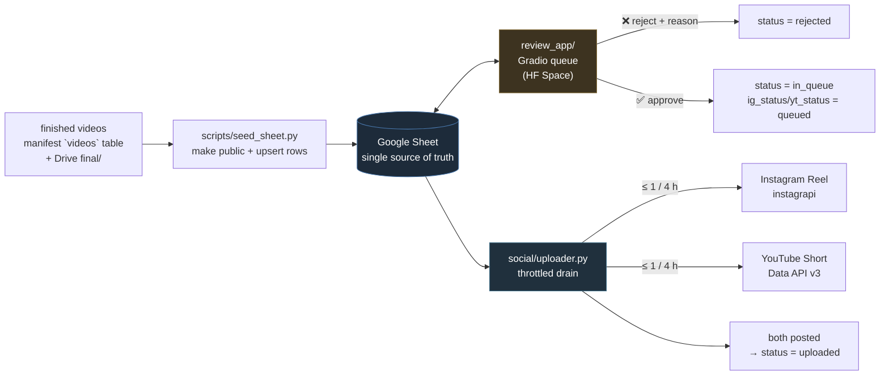

# Review & publishing

The last mile: how a finished `final.mp4` gets from Drive to a published Reel/Short, with a human
approval gate in the middle.

> Back to the [README](../README.md) · pipeline design in [ARCHITECTURE.md](ARCHITECTURE.md)

---

## Why there's a human in the loop

The pipeline is capable of running unattended, but a generative feed with no gate is a liability — one
bad output posted to a real account is worse than ten good ones being late. So the publish path is
deliberately **approve-then-trickle**: a reviewer sees each video, approves or rejects it with a reason,
and only approved videos enter a throttled upload queue.



**A Google Sheet is the database.** That is a deliberate choice, not a shortcut: reviewers need no
accounts, no VPN, and no schema migration, the state is inspectable and editable by a non-engineer, and
the same rows are readable from a laptop uploader and a hosted web app without standing up a backend.

---

## Components

| Path | Role |
|---|---|
| `scripts/seed_sheet.py` | One-time (idempotent) seed: for each finished video in a batch, make the Drive file anyone-with-link and upsert a row. Re-running only fills identity columns — it never clobbers a review decision. |
| `social/sheet.py` | All Sheet I/O. Standalone (only `gspread` + `google-auth`) so it can be bundled into the hosted app. Auth reuses the pipeline's OAuth token, from a file **or** from `GOOGLE_TOKEN_JSON` for hosted secrets. |
| `review_app/app.py` | Gradio review queue: login, random pending video embedded from Drive, Approve / Reject (+reason) / Skip, live queue counts. |
| `social/metadata.py` | Generates the description + 12–20 story-specific hashtags + a YouTube title, from the story's own logline and script (fetched from the stage-1 JSON in Drive). Runs **locally** inside the uploader, so the OpenRouter key never reaches the hosted app. |
| `social/uploader.py` | The throttled drain. Per platform per cycle: if the gate is open and a not-yet-posted approved video exists, take the oldest → ensure metadata → download → post → mark the Sheet. |
| `social/ig_adapter.py` | Instagram Reel upload via `instagrapi`, with a persisted session. |
| `social/yt_adapter.py` | YouTube Short upload via the official Data API v3 resumable upload. |

---

## Sheet schema

One row per video, keyed by `(batch_id, story_num)`.

| Column | Meaning |
|---|---|
| `batch_id`, `story_num` | Identity — matches the pipeline manifest |
| `title`, `drive_file_id`, `video_url` | Where the video is |
| `status` | `pending` → `in_queue` → `uploaded`, or `rejected` |
| `rejection_reason`, `reviewer`, `updated_at` | Audit trail — who decided what, when, and why |
| `description`, `hashtags` | Generated once, then reused (cached in the Sheet) |
| `ig_status`, `ig_url`, `ig_posted_at` | Per-platform: `""` → `queued` → `posted` / `failed` |
| `yt_status`, `yt_url`, `yt_posted_at` | Same for YouTube |

**Lifecycle:** a video is `pending` until a reviewer acts. Approval sets `status=in_queue` and both
platform states to `queued`. The uploader flips each platform to `posted` independently; when *both*
are posted, `status` becomes `uploaded`. Nothing is ever posted twice, because the uploader only
selects rows whose per-platform status isn't already `posted`.

---

## Throttling

Both platforms penalise burst posting, so the uploader enforces **at most one post per platform per
`UPLOAD_INTERVAL_HOURS`** (default 4). The gate is computed from the newest `*_posted_at` in the Sheet,
not from in-process state — which means:

- the uploader is **stateless and idempotent**; killing it loses nothing,
- it can run intermittently (whenever the laptop is on) and still respect the pacing,
- two copies running by accident won't double-post, because the gate and the "not yet posted" filter are
  both read from the shared Sheet.

```bash
# Full offline rehearsal — exercises queue + throttle + Sheet writes, posts nothing, calls no LLM
python social/uploader.py --once --dry-run

# Live: check every 30 min, post when a platform's gate is open
python social/uploader.py --loop --interval-hours 4
```

---

## Setup

### 1. Seed the Sheet

The OAuth token needs the Sheets scope as well as Drive (`shared/drive.py` requests both; re-run
`scripts/drive_auth.py` once if your token predates that).

```bash
python scripts/seed_sheet.py --batch <batch_id>
#   → creates the spreadsheet if SHEET_ID is unset and prints the id to put in .env
python scripts/seed_sheet.py --batch <batch_id> --no-public   # skip make-public
```

### 2. Deploy the review app

Free on Hugging Face Spaces — create a **Gradio** Space and upload `review_app/app.py`,
a copy of `social/sheet.py`, and `review_app/requirements.txt`. Then set Space secrets:

| Secret | Value |
|---|---|
| `SHEET_ID` | The spreadsheet id printed by `seed_sheet.py` |
| `GOOGLE_TOKEN_JSON` | The full contents of `token.json` (Drive + Sheets scope) |
| `REVIEW_USERS` | `alice:pw1,bob:pw2` — each login name is recorded as the approver/rejecter |
| `SHEET_TAB` | Optional, defaults to `videos` |

Or run it locally:

```bash
SHEET_ID=... REVIEW_USERS=admin:admin python review_app/app.py
```

### 3. Platform credentials

**YouTube** — official, IP-agnostic, ToS-compliant. Needs its own OAuth token with the
`youtube.upload` scope for the channel owner (this is *not* the Drive token). Provide via
`YT_TOKEN_PATH` or `YT_TOKEN_JSON`. Quota: `videos.insert` costs ~1600 units of a 10,000/day default,
so ~6 uploads/day — comfortably above the 1-per-4-hours pacing.

**Instagram** — `instagrapi` is **unofficial and against Instagram's Terms of Service**. It logs in as a
real account. If you use it: point it at a burner account, keep the throttle on, and run it from a
residential IP (a laptop) — datacenter logins get challenged and blocked. Credentials via `IG_USERNAME`
/ `IG_PASSWORD`; the session is persisted to `social/.ig_session.json` (gitignored) so it doesn't
re-login every run. The adapter is imported lazily, so the rest of the system works without
`instagrapi` installed at all.

---

## Failure handling

- A failed post writes `*_status = failed` plus a truncated error into the Sheet and moves on; the next
  cycle simply retries that platform (the row is still `in_queue` and not `posted`).
- The downloaded mp4 is always removed in a `finally` block, so a crash can't fill the disk.
- Metadata generation is cached in the Sheet — a retry never pays for a second LLM call.
